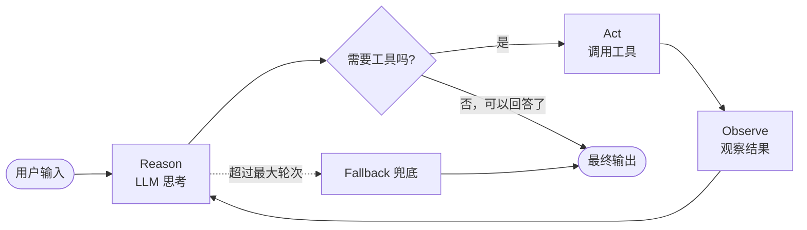
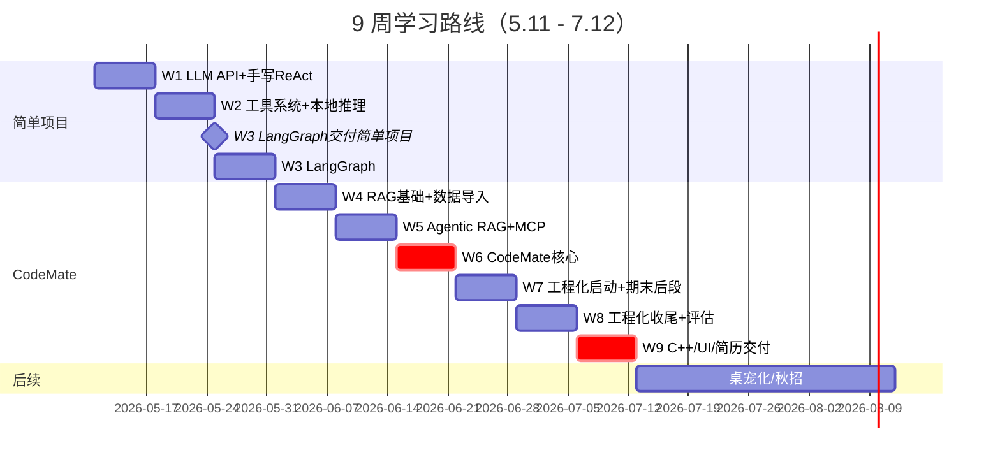
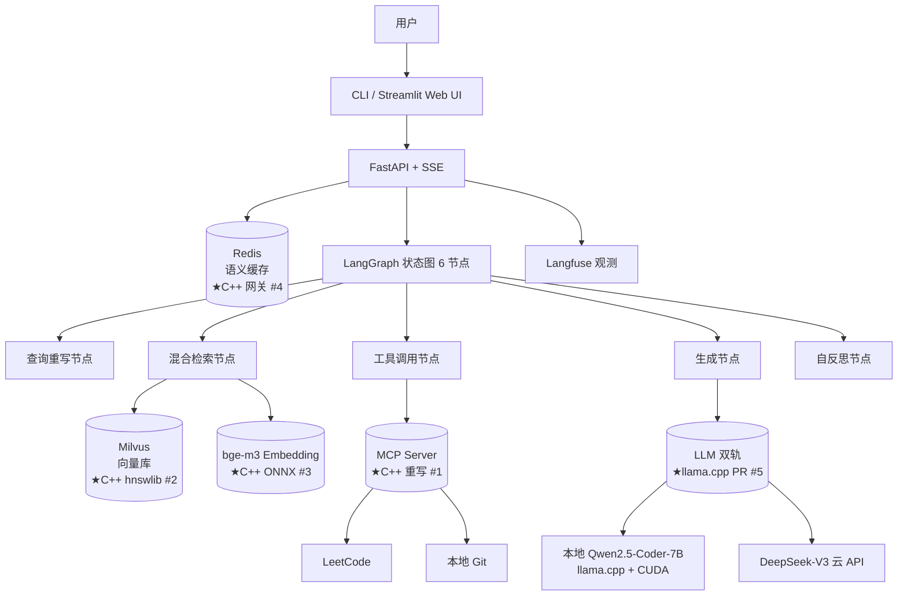
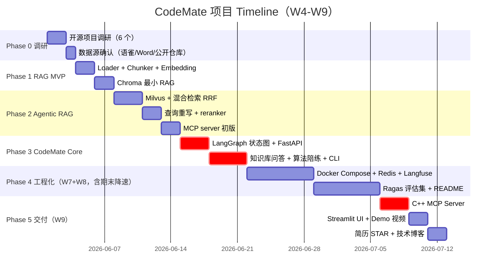

# AI Agent 学习路线 · 9 周项目交付实战手册

> 本手册以 **CodeMate 集成项目交付** 为核心组织。9 周时间线（5.11 - 7.12）不变。
>
> 阅读顺序：先 §1-§2 建立心智模型与技术栈选型，再按 §3 时间线推进，遇到项目细节查 §4-§5，简历/面试期查 §8-§9，长期补充查 §10-§11。

---

## 目录

- [1. 基础知识（心智模型）](#1-基础知识心智模型)
- [2. 技术栈与模型选择](#2-技术栈与模型选择)
- [3. 9 周时间线（含期末缓冲）](#3-9-周时间线含期末缓冲)
- [4. 简单项目：本地 ReAct Agent + Qwen2.5-Coder-7B](#4-简单项目本地-react-agent--qwen25-coder-7b)
- [5. 集成项目：CodeMate · 程序员代码学习助手](#5-集成项目codemate--程序员代码学习助手)
- [6. C++ 拓展路径（10 条可选 + 源码阅读清单）](#6-c-拓展路径10-条可选--源码阅读清单)
- [7. 工程化与评估](#7-工程化与评估)
- [8. 简历制作](#8-简历制作)
- [9. 面试题 · FAQ · 避雷指南](#9-面试题--faq--避雷指南)
- [10. 学习资源链接](#10-学习资源链接)
- [11. 长期社区与信息源](#11-长期社区与信息源)

---

## 1. 基础知识（心智模型）

### 1.1 一个比喻：把 LLM 当操作系统内核

| OS 概念 | LLM 对应物 |
|---------|-----------|
| 内核 | LLM 本身 |
| RAM | Context Window（上下文窗口） |
| 指令集 | Prompt |
| I/O 接口 | Tool Use（工具调用） |
| 文件系统 | RAG 知识库 |
| 进程/线程 | Agent 节点 |
| 进程间通信 | MCP / Agent-to-Agent |

> Andrej Karpathy 提出的 "LLM as OS" 视角，记住它你就有了一以贯之的心智模型。

### 1.2 经典范式（按学习顺序）

1. **ReAct**（Reason + Act）：观察 → 思考 → 行动 → 观察 → ……，最经典最稳，**主攻这个**。
2. **Plan-and-Execute**：先全盘规划再分步执行，适合复杂长任务。
3. **Reflection**：执行完反思一次，发现错误就重来。
4. **Multi-Agent**：多角色协作，**9 周内不学**。

### 1.3 三大组成

- **Planner**：决定下一步做什么
- **Memory**：短期（对话历史）+ 长期（向量库 / 数据库）
- **Tool Use**：函数调用、API 调用、MCP

### 1.4 ReAct Agent Loop 流程图



记住三件事：

1. 必须有 **最大轮次限制**（比如 10 轮），否则 Agent 会死循环。
2. 工具调用必须有 **Schema 强校验**（用 Pydantic），否则模型乱给参数会崩。
3. 必须有 **Fallback 路径**，模型卡死时返回一个稳定的兜底答案。

---

## 2. 技术栈与模型选择

### 2.1 模型选择：为什么是 Qwen2.5-Coder-7B-Q4_K_M

> RTX 4060 8GB 显存是硬约束，下面是 3 款主流代码模型在该硬件上的客观对比（基于 Insiderllm、Markaicode、aimadetools 2026 年公开 benchmark）。

| 模型 | Q4 显存 | HumanEval | Context | 在 4060 上能跑吗 |
|------|--------|-----------|---------|------------------|
| **Qwen2.5-Coder 7B** | **4.2 GB** | **88.4%** | **128K** | **可以，留 4GB 余量** |
| DeepSeek-Coder-V2-Lite 16B | 9 GB | 81.1% | 128K | 跑不动（超显存） |
| CodeLlama 7B | 4.5 GB | 33.5% | 16K | 能跑但质量差太多 |

**结论**：Qwen2.5-Coder-7B 是 RTX 4060 上**唯一最佳选择**。其他理由：

- 阿里出品，**中文文档/中文注释/混合代码理解强**（CodeMate 主要场景）
- llama.cpp 原生支持，CUDA 卸载开箱即用
- Apache 2.0 开源协议，简历项目可放心商用化

来源：

- [CodeLlama vs DeepSeek vs Qwen Coder 对比](https://insiderllm.com/guides/codellama-vs-deepseek-coder-vs-qwen-coder/)
- [Markaicode 2026 Benchmark](https://www.markaicode.com/vs/qwen-2-5-coder-vs-deepseek-coder/)
- [Open LLM Leaderboard](https://huggingface.co/spaces/open-llm-leaderboard/open_llm_leaderboard)

**辅用通用模型**：Qwen2.5-7B-Instruct-Q4_K_M（W2 同步装上做对比，简历能写"对比代码 vs 通用模型在 Function Calling 失败率上的差异"）。

**Embedding 模型**：[bge-m3](https://huggingface.co/BAAI/bge-m3)（智源研究院，中文向量主流，本地可跑，0 成本）。

### 2.2 必学（9 周内务必上手）

| 类别 | 工具 | 何时学 |
|------|------|-------|
| 语言 | Python 3.11+（async / typing / Pydantic） | **嵌入 W1-W3 项目里学，不单独占周** |
| 框架 | LangGraph 主线、LangChain 作组件层 | W3 集中打深，W4-W7 加节点 |
| 推理 | llama.cpp + CUDA 卸载、Ollama 过渡 | W2 起 |
| RAG | Chroma → Milvus、bge-m3 embedding | W4-W5 |
| 协议 | MCP（Model Context Protocol） | W5 |
| 工程 | FastAPI + SSE、Docker Compose | W6-W7 |
| 评估 | Langfuse 自部署、Ragas | W7-W8 |
| UI | Streamlit | W9 |

### 2.3 选学（看时间剩余决定）

- LlamaIndex（仅看 RAG 部分作为对比）
- LangSmith（付费，免费额度够调试就行）
- python-docx / unstructured.io（W4 解析 Word 笔记）

### 2.4 暂不学（9 周内不安排）

- 桌宠 Live2D（W8 后延伸方向，见 §5.9）
- AutoGen / CrewAI / Pydantic-AI、K8s、CUDA 编程深度
- 训练 / 微调（应届生秋招项目里**不建议自己微调**，反而是负分）

### 2.5 应届生加分技能（顺手收）

- Git workflow + GitHub README 撰写规范（W3 起每个项目都按规范写）
- Conventional commits + changelog
- W8 起每周写 1 篇高质量技术博客发到掘金 / 知乎

---

## 3. 9 周时间线（含期末缓冲）

### 3.0 笔记工作流（贯穿 9 周）

**写笔记的目标不止是记录，而是同时积累 CodeMate W4+ 的 RAG 知识库** —— 同一份 markdown 学习时给自己看，W4 之后给 RAG ingest。详见 [notes/README.md](notes/README.md)。

**3 种笔记类型 + 节奏**：

- **概念卡片** [notes/concepts/](notes/concepts/) · 每天学完新概念 5-15 min 写 1 张 · 目标 W1-W9 共 40-60 张
- **翻车记录** [notes/crashes/](notes/crashes/) · 遇 1h+ bug 解决后立即写 · 面试反挖最值钱
- **周总结** [notes/weekly/](notes/weekly/) · 每周日 30 min · 沉淀本周 STAR 素材

**一键建笔记**：

```bash
python tools/new-note.py concept "Pydantic V2 BaseModel"
python tools/new-note.py crash "ReAct 死循环"
python tools/new-note.py weekly       # 周日跑一次
```

**与 CodeMate RAG 的对接**（W4 启动后）：

```bash
codemate ingest --source ../ai-agent-roadmap/notes/concepts \
                --source ../ai-agent-roadmap/notes/crashes \
                --source ../ai-agent-roadmap/notes/weekly
```

笔记里 YAML frontmatter 的 `week` / `type` / `tags` / `status` 会变成 chunk metadata，支持「我 W3 学了哪些 LangGraph 概念」「我有哪些 RAG 翻车」之类的高级过滤查询。

### 3.1 总览甘特图



> **说明**：原 W0（Python 速通周）已删除，Python 拆散嵌入 W1-W9 项目周，边写项目边查语法。每周计划里会出现"**Python 嵌入任务**"子项；4 条学习线（Python / LangGraph / 项目基础 / C++ 联动）的完整地图见 §3.3。

### 3.2 详细周计划

#### W1（5.11 - 5.17）· LLM API + 手写 ReAct · ~26h

> **日级执行清单**：[weekly/W1.md](weekly/W1.md) — 6 天逐日资料 / 任务 / DoD / 自测题

**心智目标**：彻底搞懂 LLM 调用的所有细节，不依赖任何框架手写一个 ReAct 循环。同步把 Python 嵌入项目里学。

**Python 嵌入任务**（前 2 天，每天 2-3h，跟着 Cursor 边写边问）：

- [ ] 安装 Miniconda + Python 3.11 + [uv](https://github.com/astral-sh/uv)（极快的 Python 包管理器）
- [ ] 装 NVIDIA CUDA Toolkit 12.x + 验证 `nvidia-smi` + `nvcc --version`
- [ ] 注册 [DeepSeek 平台](https://platform.deepseek.com)，充值 ¥20，跑通 `hello_llm.py`（流式调用 + 打印 token 用量）
- [ ] 边写 ReAct 边掌握：`requests` 流式（`stream=True`）、`async/await`、`typing`、`pydantic.BaseModel`、`json.JSONDecodeError` 处理

**关键概念**：

- Token / Context Window / Temperature / Top-p
- System / User / Assistant 三种 message 角色
- Function Calling（OpenAI Tools 格式）
- Schema 强校验
- ReAct prompt 模板

**项目任务**：

- [ ] 读 [OpenAI Tools 官方文档](https://platform.openai.com/docs/guides/function-calling)（DeepSeek 兼容此格式）
- [ ] 不用任何 Agent 框架，纯 Python + requests 实现一个最小 ReAct 循环
- [ ] 工具：先就一个`计算器`工具（加减乘除）
- [ ] 加上最大轮次限制 + JSON 解析失败重试 + 兜底输出

**周末自检**：

1. `async def` 和普通函数的区别？为什么 LangGraph 节点都建议写成 async？
2. Pydantic `BaseModel` 怎么校验 LLM 返回的 JSON？为什么 LLM 输出的 JSON 经常包含 ```json ```，怎么稳健提取？
3. 你的 ReAct loop 死循环了，怎么排查（看哪些字段）？Token 估算公式是什么？

**产出物**：`simple_react/main.py`，commit 到一个公开 GitHub 仓库 `simple-react-agent`。

---

#### W2（5.18 - 5.24）· 工具系统 + 本地推理 · ~26h

**心智目标**：让 ReAct 真正能干活；同时让本地 RTX 4060 跑起来。

**Python 嵌入任务**：

- [ ] `subprocess.run` 做 shell 工具（注意安全：命令白名单 + timeout + 禁危险参数）
- [ ] `httpx` 异步 HTTP 客户端，对比 `requests`，理解 sync vs async 何时收益最大
- [ ] `pathlib` 路径操作、`dataclass` 描述工具配置、自定义异常类做兜底链路

**项目任务**：

- [ ] 给 ReAct 加 4 个工具：shell 命令、HTTP 请求、文件读写、搜索（用 [Tavily](https://tavily.com) 免费额度）
- [ ] 每个工具加 Pydantic Schema 校验
- [ ] 装 [llama.cpp](https://github.com/ggml-org/llama.cpp)（开 CUDA 编译）
- [ ] 下载 [Qwen2.5-Coder-7B-Instruct-Q4_K_M.gguf](https://huggingface.co/Qwen/Qwen2.5-Coder-7B-Instruct-GGUF)
- [ ] 跑通 `llama-server -m Qwen2.5-Coder-7B-Instruct-Q4_K_M.gguf --gpu-layers 35 --port 8080`
- [ ] 把你的 ReAct 切到本地端点，跑一轮对比延迟/质量

**周末自检**：

1. `--gpu-layers` 参数什么意思？怎么算最大可卸载多少层？
2. 本地 7B 比 DeepSeek-V3 慢/快多少？质量差别在哪？
3. Qwen2.5-Coder 在 Function Calling 任务上比通用 Qwen2.5 好/差在哪？

**产出物**：`simple-react-agent` 仓库支持云 API 和本地端点切换。

---

#### W3（5.25 - 5.31）· LangGraph + 简单项目交付 · ~26h

**心智目标**：用框架重写一遍，理解状态图思想；交付简单项目。**LangGraph 框架知识本周打深，后续 W4-W7 只是"在 LangGraph 里加节点"**。

**Python 嵌入任务**：

- [ ] `TypedDict` / `Annotated` —— LangGraph 状态 schema 必备
- [ ] decorator（`@functools.wraps`）—— 节点注册与日志
- [ ] Generator / `yield` —— 流式输出基础
- [ ] context manager（`with` / `contextlib`）—— checkpoint 资源管理

**LangGraph 学习重点**（本周一次性吃透，后面只复习不再系统学）：

- StateGraph 与节点/边
- 条件边（`add_conditional_edges`）的写法和返回值约定
- Checkpoint 与 HITL（中断 → 人工确认 → 恢复）
- 状态归并（reducer，如 `add_messages`）
- 子图嵌套（W6 会用上）
- 流式输出（`stream` / `astream` / `astream_events`）

**项目任务**：

- [ ] 跟完 [LangGraph 官方 Tutorial](https://langchain-ai.github.io/langgraph/tutorials/introduction/)
- [ ] 把 W1-W2 的 ReAct 用 LangGraph 重写：6 节点（reason / decide / act / observe / fallback / end）
- [ ] 加 HITL（Human-in-the-loop）：危险操作（如 shell 删文件）让用户确认
- [ ] 给项目写一份高质量 README（参考 §8.3 模板）
- [ ] 录一段 60 秒 demo 视频
- [ ] 把仓库设为 public，pin 到 GitHub Profile

**周末自检**：

1. 为什么 LangGraph 是状态图而不是简单的链？状态图带来什么本质优势？
2. HITL 的中断机制怎么实现的（checkpoint）？
3. 节点函数和边函数的区别？

**产出物**：**简单项目交付**，仓库 `simple-react-agent` v1.0.0 上 GitHub。

---

#### W4（6.1 - 6.7）· RAG 基础 + 数据导入 · ~26h

**心智目标**：理解 RAG 的每个环节，跑通本地最小 RAG。

**Python 嵌入任务**：

- [ ] [python-docx](https://python-docx.readthedocs.io/) 解析 Word；`pathlib` 批量遍历笔记目录
- [ ] 自己手写一个 fixed / sentence chunker（~100 行），先不调库
- [ ] `sentence-transformers` 调 bge-m3，[Chroma](https://www.trychroma.com/) Python API

**关键概念**：

- 分块策略（fixed / sentence / semantic）
- Embedding 模型（bge-m3）
- 向量库（先用 Chroma 入门）
- 召回 / 重排 / 引用

**项目任务**：

- [ ] 安装 Chroma + bge-m3
- [ ] 实现三个 loader：
  - `yuque_loader.py`（[语雀 API](https://www.yuque.com/yuque/developer)）
  - `xiaolin_loader.py`（克隆 [xiaolincoder/CS-Base](https://github.com/xiaolincoder/CS-Base) 直接读 markdown）
  - `docx_loader.py`（python-docx）
- [ ] 跑通最小 RAG：导入 → 分块 → 向量化 → 检索 → LLM 生成
- [ ] 测一个固定问题集（10 题），算一个粗略召回率

**周末自检**：

1. 同一段文本用 fixed 256 vs sentence 分块，召回率差多少？
2. bge-m3 输出维度多少？为什么不用 OpenAI text-embedding-3？
3. 引用来源怎么传给 LLM 又不污染回答？

**产出物**：本地能问"小林 coding 里 TCP 三次握手为什么"并带页面引用。

---

#### W5（6.8 - 6.14）· Agentic RAG + MCP · ~26h

**心智目标**：把 RAG 提级为 Agentic（智能化），并接通 MCP 协议。

**Python 嵌入任务**：

- [ ] `asyncio` 并发：BM25 检索 + 向量检索并发跑，理解 `asyncio.gather`
- [ ] stdio JSON-RPC（MCP server 走 stdio + JSON-RPC，先读 [MCP Python SDK](https://github.com/modelcontextprotocol/python-sdk) 一段示例）
- [ ] Docker Compose 起 Milvus（顺便熟悉 `docker compose up/down/logs`）

**关键概念**：

- 查询重写、HyDE
- 混合检索（BM25 + 稠密向量）
- Reranker
- MCP（Model Context Protocol）协议

**项目任务**：

- [ ] 用 [Milvus 单机版](https://milvus.io/docs/install_standalone-docker.md) 替换 Chroma（Docker Compose 起）
- [ ] 实现混合检索：BM25 召回 50 + 向量召回 50，Reranker 选 top 10
- [ ] 实现查询重写节点（让 LLM 先把口语化问题改写成检索友好的 query）
- [ ] 跟 [MCP 中文文档快速入门](https://modelcontextprotocol.info/zh-cn/docs/quickstart/quickstart/)
- [ ] 写一个 MCP server，工具：
  - `get_leetcode_problem(problem_id)` 拿题目
  - `submit_solution(code, language)` 提交（先 mock）
  - `read_local_repo(path)` 读你本地的 git 仓库
- [ ] 把这个 MCP server 接到 Cursor / Claude Desktop，体验一次

**周末自检**：

1. HyDE 是什么？什么场景下比直接检索好？
2. 为什么需要 Reranker？什么时候不需要？
3. MCP 和 OpenAI Tools 区别在哪？为什么 MCP 用 stdio + JSON-RPC？

**产出物**：`codemate-mcp-server` 独立公开仓库，README 含示意图。

---

#### W6（6.15 - 6.21）· CodeMate 核心 · ~26h（**期末前关键周**）

**心智目标**：把所有零件组装成 CodeMate v0.1，**先做必做的两个功能保 MVP**。**下周五（6.26）起进入期末**，本周必须把 v0.1 交付掉，否则期末期间没有冲刺余地。

> **可行性提醒**：W6 是整个路线最容易翻车的一周。务必读 §5.6 分级 MVP + 库替代退路 再动手。

**Python 嵌入任务**：

- [ ] [FastAPI](https://fastapi.tiangolo.com/) 路由 + 依赖注入 + Pydantic 请求体校验
- [ ] SSE 流式响应（`StreamingResponse` + `async generator`）
- [ ] `sqlite3` / SQLAlchemy 持久化对话历史
- [ ] `pydantic-settings` 读取 `.env`（API key 不硬编码）

**任务（按 Tier 分级，对应 §5.6）**：

- [ ] **Tier 1（MVP 底线）**：知识库问答（功能 A）+ 算法陪练（功能 B）+ MCP hello-world + CLI
- [ ] **Tier 2（应做）**：FastAPI + SSE 流式输出包装
- [ ] **Tier 2（应做）**：基本的对话历史持久化（SQLite）
- [ ] **Tier 3（加分）**：代码 review（功能 C）
- [ ] **Tier 3（加分）**：学习计划编排（功能 D）—— 时间不够就推到 W9

**架构图见 §5.2。**

**周末自检**：

1. CodeMate 的 LangGraph 状态图是几个节点？为什么这么设计？
2. 同时支持云 API 和本地 llama.cpp，运行时切换怎么实现？
3. 算法陪练的"掌握度"怎么存？用什么数据结构？

**产出物**：`codemate` 主仓库 v0.1.0 tag，CLI 可运行 + README 含架构图。

---

#### W7（6.22 - 6.28）· 工程化启动 + 期末后段降速 · ~22h

**心智目标**：W6 已交付 v0.1，本周做工程化"硬活"。**6.26（周五）起进入期末**，后 3 天明显降速。

**节奏建议**：

- 周一–周四（4 天 × 4h = 16h）：工程化主线
- 周五–周日（3 天 × 2h = 6h）：期末降速，做"整理活"

**Python 嵌入任务**：

- [ ] Docker Compose 多服务编排 + 自定义网络
- [ ] Redis Python 客户端、`hashlib` 算语义缓存 key

**任务**：

- [ ] Docker Compose 一键起：FastAPI + Milvus + Redis + Langfuse（本周最硬的活）
- [ ] [Langfuse](https://github.com/langfuse/langfuse) 自部署，给 LangGraph 每个节点埋点
- [ ] Redis 语义缓存层（参考 [redis-llm-cache](https://github.com/redis/redis-py) 思路）：先算 query embedding，命中阈值则旁路 LLM
- [ ] 期末降速期（周末 3 天）：截图 Langfuse 链路图、整理 README 草稿

**周末自检**：

1. Langfuse trace 能完整看到一次问答的所有节点耗时吗？哪个节点最慢？
2. Redis 缓存命中时怎么绕过 LLM 调用？阈值设多少合理？
3. Docker Compose 重启后向量库数据还在吗？怎么持久化？

**产出物**：`codemate` 工程化骨架就绪（Docker Compose + Langfuse + Redis），README 草稿。

---

#### W8（6.29 - 7.5）· 工程化收尾 + 评估 · ~18h（**期末深度降速**）

**心智目标**：期末第二周深度降速，做"低烧脑度但拿得出去"的活。周日 7.5 期末结束，可以加一把劲收尾。

**节奏建议**：

- 周一–周六（6 天 × 2h = 12h）：期末降速，做评估和文档
- 周日 7.5（1 天 × 6-8h）：期末结束，本周冲刺收尾

**Python 嵌入任务**：

- [ ] `pytest` 写 5-10 条 RAG 用例（输入 → 期望片段 → assert 检索结果包含期望）
- [ ] [Ragas](https://github.com/explodinggradients/ragas) Python SDK

**任务（全是低烧脑度的）**：

- [ ] 用 Ragas 做一个 30 题评估集：Faithfulness / Answer Relevance / Context Precision
- [ ] 把 W7 写好的 README 草稿打磨到满分（按 §8.3 模板）
- [ ] 测召回率 / 缓存命中率 / token 成本三个指标，截图入 README
- [ ] 录一段 2 分钟项目 demo 视频（CLI 版本即可，W9 再录 Web UI 版）

**周末自检**：

1. 你的 Faithfulness 分数多少？哪类问题分数最低？
2. Redis 语义缓存命中率多少？怎么算的？
3. Token 总成本是多少？月预算还剩多少？

**产出物**：`codemate` v0.5.0 tag，含完整工程化、评估、可观测、README、CLI Demo 视频。

---

#### W9（7.6 - 7.12）· C++ 拓展 + Streamlit UI + 简历交付 · ~30h

**心智目标**：期末已过，状态回升。本周是真正的"简历周"，4 个必做产出全在这周收口。

**Python / Streamlit 嵌入任务**：

- [ ] [Streamlit](https://streamlit.io/) 速通（半天）：chat 组件、sidebar、session_state、`st.write_stream`
- [ ] 截图 / Demo 视频录制工具链（OBS Studio / ScreenStudio）

**任务（按优先级）**：

- [ ] **必做**：C++ 拓展第 1 档至少做 1 个（见 §6.1，建议 C++ MCP Server）
- [ ] **必做**：写简易 Streamlit Web UI，截 5 张高质量截图
- [ ] **必做**：写第 1 篇技术博客（按 §5.9 选题）
- [ ] **必做**：简历 STAR 写好（按 §5.7 范例）
- [ ] **应做**：补一个 C++ 拓展第 2 档（如 hnswlib 自写）
- [ ] **应做**：录新版 demo 视频（带 Web UI 演示）
- [ ] **选做**：把简单项目（W3 交付的 simple-react-agent）也补一份高质量 README

**周末自检**：

1. 你的 C++ MCP server 比 Python 版 QPS 高多少？为什么？
2. 简历 STAR 中每个数字都能讲清楚吗？面试官追问怎么应对？
3. 项目最大的两个亮点是什么？45 秒能讲清吗？

**产出物**：`codemate` v1.0.0 tag + `codemate-cpp-tools` C++ 拓展仓库 + 1 篇博客 + 简历 1.0。

---

### 3.3 嵌入式学习地图（4 条学习线 × 9 周）

> §3.2 是**周计划（按时间组织）**，本节是**知识索引（按学习线组织）**：4 条学习线分别在哪几周学到什么深度，一图说清。
>
> 用法：每周开始时先看你这周对应的列，明确"项目里我要顺便掌握什么"。

| 学习线 | W1 | W2 | W3 | W4 | W5 | W6 | W7 | W8 | W9 |
|---|---|---|---|---|---|---|---|---|---|
| **Python** | requests · async/await · Pydantic · typing · JSON 处理 | subprocess · httpx · dataclass · 异常链 | TypedDict · Annotated · decorator · Generator · contextmanager | python-docx · pathlib · 文本切分 · sentence-transformers | asyncio.gather · stdio JSON-RPC · Docker SDK | FastAPI · SSE · SQLAlchemy · pydantic-settings | Docker Compose · Redis client · hashlib | pytest · Ragas SDK | Streamlit |
| **LangGraph 框架** | — | — | **核心周**：StateGraph · 节点/边 · 条件边 · checkpoint · HITL · reducer · 子图 · stream/astream | 把 RAG pipeline 串成 LangGraph 节点 | 加入查询重写 / Reranker / 工具调用节点 | 6 节点完整图（reason/retrieve/decide/act/observe/end）· 双模型切换 | Langfuse 给每个节点埋点 | — | — |
| **项目基础知识** | LLM 参数 · Token 估算 · Function Calling Schema · ReAct 范式 | GGUF 量化 · GPU 卸载层 · prompt 工程 · 本地/云双轨 | 状态机思想 · README 工程化 · Git 规范（commit 拆分） | Embedding 维度 · 分块策略 · 召回率 · 引用溯源 | BM25 vs 稠密向量 · Reranker · HyDE · MCP 协议（stdio + JSON-RPC） | Agent 架构设计 · 持久化 · SSE 流式 · MVP 分级 | Docker Compose · 可观测性 · 语义缓存策略 | RAG 评估指标 · badcase 分析 · 成本计量 | 简历 STAR · 技术博客写作 · Demo 视频脚本 |
| **C++ 联动** | — | — | — | — | — | — | — | — | C++ MCP server / hnswlib 微服务（必做 1 个，见 §6.1） |

**怎么把"知识"嵌进"做项目"里**：

- **Python**：从 W1 第一天起你就在写项目，**不要花时间单独看 Python 教程**。遇到陌生语法就在 Cursor 里追问"这段代码 X 行为什么这样写"。每周末花 30 分钟回看本周代码，挑 3 处"当时不懂、现在懂了"的点记到学习笔记里。把 Python 当 C++ 写，丑代码先跑通，再回头重构。
- **LangGraph**：**W3 是核心周**，集中读官方 Tutorial 一遍（半天）+ 重写 W1-W2 的 ReAct（4-5 天）。后续 W4-W7 只是"在 LangGraph 里加节点 / 接埋点"，不需要再系统学。W3 这一周如果框架没吃透，**宁可推迟简单项目交付一两天**也要把状态图、HITL、reducer 概念搞清楚。
- **项目基础知识**：每周周末自检题就是"知识抽查"。**自检题答不出来就把对应概念读一遍博客或官方文档**，不要假装会了往下推——后续周次都建立在前面概念之上。
- **C++ 联动**：前 8 周完全不碰，**W9 集中做**。10-15h 足够交付 1 个拓展。具体做哪个见 §6.1。

#### 后续（7.13+）· 桌宠化 / 秋招冲刺

按 §5.9 延伸方向，从中挑 1-2 个深做（强烈建议桌宠 + 博客系列）。同步开始投简历、刷面经、对应岗位 JD 拆解。

---

## 4. 简单项目：本地 ReAct Agent + Qwen2.5-Coder-7B

> W1-W3 交付，约 50-60 小时。这是简历的"独立交付"证明项目。

### 4.1 主推方案：本地 ReAct Agent + llama.cpp 跑 Qwen2.5-Coder-7B

**一句话**：不用任何 Agent 框架，纯 Python 调用 llama.cpp 的 OpenAI 兼容 server（开 CUDA 卸载到 RTX 4060），手写 ReAct 循环 + 4 个工具（shell、HTTP、文件、计算器）。

**简历亮点**：

1. 不依赖任何框架手写 ReAct 循环：含 Schema 强校验、Fallback 降级、Token 数控制
2. 本地 RTX 4060 跑 Qwen2.5-Coder-7B-Q4 benchmark：tok/s、首字延迟 P95、显存占用
3. 工具调用稳定性：用固定测试集对比通用模型 vs 代码模型在 Function Calling 任务上的失败率
4. 简单的成本/延迟对比：本地 vs DeepSeek-V3 云 API

**C++ 拓展接入点**（W9 至少做 1 个）：

- 读 `llama.cpp/examples/server/server.cpp` 写中文笔记博客
- 加 GBNF grammar 约束 JSON tool call，对比 grammar 前后失败率
- C++ 写一个高性能工具进程（stdio JSON-RPC），对比 Python 版吞吐

**难度**：⭐⭐ ｜ **简历价值**：高（量化数据 + C++ 增量）

### 4.2 备选 A：MCP Server for MySQL/Redis（贴合后端强项）

**一句话**：用 Python MCP SDK 暴露 MySQL/Redis 工具给 Claude Desktop / Cursor，让 LLM 帮你做日常查询。

**简历亮点**：MCP 协议早期实践、Schema 设计、安全护栏（只读账号、SQL 白名单）。

**C++ 拓展点**：用 C++ 重写同一个 MCP server（见 §6.1 第 1 条）。

### 4.3 备选 B：浙大教务/课程问答 RAG

**一句话**：爬取浙大公开的课程信息/选课指南/教学日历做成 RAG，用 LangGraph 编排查询。

**简历亮点**：有真实校园场景、能演示给同学看（潜在用户增长故事）。

**C++ 拓展点**：把向量库从 Chroma 换成 [hnswlib](https://github.com/nmslib/hnswlib) 自封装。

**注意**：仅爬取公开页面，遵守 robots.txt。

> 三选一原则：默认主推；对 MySQL 工具更有热情选备选 A；想做有"用户故事"的项目选备选 B。

---

## 5. 集成项目：CodeMate · 程序员代码学习助手

> 秋招简历的**主推项目**，W4-W8 交付，~130-150 小时。

### 5.1 项目目标 + 4 个核心功能

**一句话定位**：为 27 届程序员应届生设计的 AI 学习搭子——导入个人/公开学习资料 → RAG 问答 + 算法陪练 + 代码 review + 学习计划编排。9 周后还能延伸为桌宠形态。

**核心功能（4 个）**：

| # | 功能 | 输入 | 输出 | Tier |
|---|------|------|------|------|
| A | 知识库问答（RAG） | "TCP 三次握手为什么不能两次" | 带引用的解释，引用来源是导入的小林 coding | Tier 1 |
| B | 算法陪练 | "我不熟 DP" | 推一道 LeetCode 题 → 提交解 → LLM review → 记录掌握度 | Tier 1 |
| C | 代码 review | 一段 C++/Python 代码 | 复杂度分析 + 潜在 bug + 改进建议 | Tier 3 |
| D | 学习计划编排 | "两周内掌握 LangGraph" | 14 天日级计划，含每日任务和参考资料 | Tier 3 |

Tier 含义见 §5.6。

### 5.2 整体架构

> 详细架构、模块职责、关键设计决策见 [codemate/docs/architecture.md](../codemate/docs/architecture.md)。本节给出顶层视图。



5 个 C++ 拓展接入点详见 §6。

**技术栈速览**（与 architecture.md 同步）：

- **编排**：LangGraph（状态图 + HITL）
- **模型**：本地 Qwen2.5-Coder-7B-Q4_K_M（主）+ Qwen2.5-7B（对比）+ DeepSeek-V3 云 API（备）
- **推理**：llama.cpp + CUDA 卸载
- **检索**：Milvus + bge-m3 + BM25 + RRF + Cross-Encoder Reranker
- **服务**：FastAPI + SSE 流式
- **缓存**：Redis 语义缓存
- **部署**：Docker Compose 一键起
- **观测**：Langfuse 自部署
- **评估**：Ragas（Faithfulness / Answer Relevance / Context Precision）
- **工具**：MCP server 暴露 LeetCode、本地 git、文件系统
- **UI 演进**：W6-W8 是 CLI；W9 加 Streamlit；秋招前可叠 Live2D 桌宠

### 5.3 借鉴的开源项目（6 个）

直接 fork / 学习架构 / 引用致敬，不必重造轮子。**前 3 个是 Phase 0 调研的主参考，后 3 个是 Phase 0 末识别的盲区补丁**。

| 项目 | Star | 借鉴密度 | 借鉴点 | 阅读优先级 |
|------|------|---------|--------|----------|
| [khoj-ai/khoj](https://github.com/khoj-ai/khoj) | 33.8k | 概念高 / 代码低 | RAG pipeline 思路、对话历史截断、强制引用 prompt | 已读完 |
| [Mintplex-Labs/anything-llm](https://github.com/Mintplex-Labs/anything-llm) | 58.8k | 架构高 / 代码低 | LOADER_REGISTRY 模式、DocumentRecord schema、metadata header 注入、MCP 桥接 | 已读完 |
| [SPerekrestova/interactive-leetcode-mcp](https://github.com/SPerekrestova/interactive-leetcode-mcp) | — | **代码高** | **LeetCode GraphQL + Submit/Cookie 逻辑直接移植** | 已读完 |
| **[onyx-dot-app/onyx](https://github.com/onyx-dot-app/onyx)** | 13k+ | **架构高 / 代码高** | **真混合检索 RRF + Cross-Encoder + LangGraph 实战范本** | **W5 启动前必读** |
| **[modelcontextprotocol/python-sdk](https://github.com/modelcontextprotocol/python-sdk)** | — | **代码高** | **Python MCP server hello-world，CodeMate `mcp_server/` 起步代码** | **W5 第 1 天必读** |
| **[langchain-ai/open_deep_research](https://github.com/langchain-ai/open_deep_research)** | — | **代码高** | **LangGraph 多节点状态图实战范本，CodeMate `graph/` 风格对照** | W5 末写状态图时对照 |

各项目的详细借鉴清单（精确到文件名）见 [reference/README.md](../reference/README.md) 和 [codemate/docs/phase0-investigation.md](../codemate/docs/phase0-investigation.md) §7.3 借鉴溯源矩阵。

> **README 与简历定位话术**：参考 Khoj 与 AnythingLLM 的架构，针对应届生学习场景做垂直定制和深度工程化。大方致敬，重点讲融合扩展工作。

### 5.4 我的思路与创新点

**CodeMate 区别于"又一个 LangChain RAG demo"的 6 个差异化点**。前 3 件是简历核心，不可被库替代（见 §5.6）。

#### 创新 1（简历核心）· 真正的 BM25 + 稠密 + RRF + Cross-Encoder 混合检索

**动机**：Khoj 的"hybrid"只是向量 + filter，AnythingLLM 的"hybrid"只是向量 + rerank，都不是真正的 BM25 + 稠密融合。CodeMate 是少数真做的开源 RAG。

**实现要点**：

```python
class HybridRetriever:
    async def retrieve(self, query: str, top_k: int = 10) -> list[Chunk]:
        bm25_hits, dense_hits = await asyncio.gather(
            self.bm25.search(query, k=50),
            self.dense.search(query, k=50),
        )
        fused = reciprocal_rank_fusion([bm25_hits, dense_hits], k=60)
        reranked = await self.reranker.rerank(query, fused[:30])
        return reranked[:top_k]
```

**对应代码**：`codemate/retrieval/hybrid.py`（自写 RRF ~50 行 + Reranker 调用）

**简历话术**：实现 BM25 + bge-m3 稠密 + RRF 融合 + Cross-Encoder 精排，在 30 题评估集上召回率 @5 达 92%，比单稠密提升 14%。

#### 创新 2（简历核心）· 自研 Python MCP Server

**动机**：MCP 是 2024 年才推出的新协议，市场上几乎没有候选人有"亲手写过 MCP server"的经验。leetcode-mcp 是 TypeScript 的，对 Python 候选人不直接可用。

**实现要点**：

- 用 `modelcontextprotocol/python-sdk` 官方 SDK，stdio + JSON-RPC 传输
- 暴露工具：`get_problem` / `submit_solution` / `read_local_repo`
- Schema 强校验、超时控制、白名单护栏

**对应代码**：`codemate/mcp_server/server.py` + `codemate/tools/`

**简历话术**：自研 MCP server，集成 Cursor + Claude Desktop，让 LLM 直接调用本地 Git 与 LeetCode 工具。

#### 创新 3（简历核心）· LeetCode 工具 Python 移植

**动机**：leetcode-mcp 是 TypeScript，把 GraphQL 查询字符串 + Submit/Cookie/CSRF 逻辑移植到 Python httpx 是真活，包含 slug↔questionId 解析、`LEETCODE_SESSION` cookie + `X-CSRFToken` header 处理。

**实现要点**：

- 移植 leetcode-mcp 的 GraphQL 查询字符串到 Python（~30 个查询字典）
- 实现 `submitSolution` / `getQuestionId` / `validateCredentials` 三个核心方法
- 提交结果轮询（间隔 1s、最多 30 次）

**对应代码**：`codemate/tools/leetcode.py` + `codemate/tools/leetcode_credentials.py`

**简历话术**：移植 TypeScript LeetCode 客户端到 Python，处理 CSRF + Cookie + slug/questionId 三重身份解析。

#### 创新 4· 算法掌握度 + FSRS 间隔复习

**动机**：功能 B 算法陪练需要"今天该复习哪些"。简单做法是艾宾浩斯曲线，但 FSRS（Free Spaced Repetition Scheduler）算法准确率高得多。

**实现要点**：

- MVP 用简单 score + last_review_at 评分（Ebbinghaus 简版）
- W9 加分项：升级为 `py-fsrs`（pip 装即用）

**对应代码**：`codemate/persistence/mastery.py`

**简历话术**：基于 FSRS 算法实现算法题间隔复习，根据 verdict + 间隔自适应调整下次复习时间。

#### 创新 5· 双轨 LLM 切换（本地 Qwen + 云 DeepSeek）

**动机**：应届生秋招项目里同时有"本地推理"和"云 API"叙述很罕见，加分项。

**实现要点**：

```python
class LLMClient(Protocol):
    async def chat(self, messages, **kw) -> AsyncIterator[str]: ...

class DeepSeekClient(LLMClient): ...
class LocalLlamaClient(LLMClient): ...  # llama.cpp OpenAI 兼容

def make_llm() -> LLMClient:  # 工厂从 .env 读 LLM_DEFAULT_BACKEND
    ...
```

**对应代码**：`codemate/llm/`

**简历话术**：本地 llama.cpp 推理 + DeepSeek 云 API 双轨切换，429 自动降级。

#### 创新 6· 强制引用 RAG（学 Khoj 但实现自写）

**动机**：RAG 最大的坑是"模型瞎编"。强制 inline `[1] [2]` 引用 + 正则后处理是性价比最高的防幻觉手段。

**实现要点**：

- Prompt 工程：System Prompt 明确要求"每条事实陈述后用 [N] 标注"
- 后处理：正则抽取 `[N]` 编号 → 映射回 chunk 的 `chunk_source` + `metadata.section`
- 输出给前端：回答正文 + citations 数组

**对应代码**：`codemate/features/rag_qa.py` 中的 prompt + `codemate/graph/nodes/generate.py` 中的后处理

**简历话术**：强制引用 RAG，Ragas Faithfulness 0.85+。

### 5.5 实施路径选项

W4 启动前必须做的选择题。3 条路径并列，**默认推荐路径 B**。

| 路径 | 底座 | 工作量 | 简历强度 | 9 周可行性 |
|---|---|---|---|---|
| A · fork kotaemon | [Cinnamon/kotaemon](https://github.com/Cinnamon/kotaemon) | 低（~800-1200 LOC） | ★★ | 70-95% |
| **B · 库组合从 0 写**（默认） | 无固定底座，langgraph + mcp Python SDK + pymilvus + FlagEmbedding 等库为地基 | 中（~3000 LOC） | **★★★★★** | 50-85% |
| C · LangGraph 模板拼接 | `langgraph` 仓库 `examples/rag/agentic_rag/` | 中低（~1800-2200 LOC） | ★★★½ | 60-90% |

**默认 B 的理由**：

- 简历最强：每个差异化模块（§5.4 的 6 条）都是"我亲手写的"
- 学习最深：覆盖 RAG / Agent / MCP / 评估 / 可观测 全栈技能
- 上游依赖风险最低：用成熟库当地基，不依赖任何活跃 fork

**改选触发条件**（按时间顺序）：

| 关口 | 信号 | 触发动作 |
|---|---|---|
| W4 末 | RAG QA P95 > 10s 或召回率 < 70% 或 Chroma 跑不通 | **切路径 A**：W4 周末用 kotaemon 已调好的 pipeline 转 fork |
| W5 末 | MCP hello-world 写不出 或 LangGraph 6 节点设计卡死 | **切路径 C**：用 langgraph examples 模板起步 |
| 期末（W7-W8）| 实际工时 < 12h/周 | **B 内降级**：保留 §5.4 差异化三件套（RRF / MCP / LeetCode），砍 Tier 3 项 |
| W6 末 | Tier 1 没达成（功能 A 没跑通 / 引用没做）| **冻结新功能**，W7 全周补 Tier 1 |

3 路径详细对比（候选底座对比、库选型表、决策矩阵、各路径下的可砍可加建议）见 [codemate/docs/phase0-investigation.md](../codemate/docs/phase0-investigation.md) §9。

### 5.6 分级 MVP + 库替代退路

#### 5.6.1 Tier 分级

每周末 checkpoint 评估，决定下周是否升 Tier 或降级。

| Tier | 内容 | 截止 | 简历价值 |
|---|---|---|---|
| **Tier 1（必达）** | 功能 A 跑通 + 引用 + MCP hello-world + LeetCode `get_problem` + CLI | W6 末 | "能用的 RAG + MCP server"——最低及格线 |
| **Tier 2（应做）** | + 真混合检索 RRF + 算法掌握度（Ebbinghaus 简版）+ Reranker + Ragas 30 题评估 | W8 末 | "Agentic RAG + 评估闭环"——能讲故事 |
| **Tier 3（加分）** | + Code Review 功能 + Streamlit UI + FSRS + Langfuse + 1 个 C++ 拓展 | W9 末 | "完整产品 + 系统底层"——简历亮点 |

#### 5.6.2 库替代退路（核心 14 个模块）

每个模块在"时间不够"时的退路。**粗体行是简历核心，不可替代**：

| 模块 | 计划做法 | 时间不够时退路 | 代价 |
|---|---|---|---|
| `loaders/` | `unstructured` 包封装 | 切 `langchain.document_loaders` | 引用粒度变粗 |
| `chunkers/` | `langchain-text-splitters` | 同上，无变化 | 无 |
| `embeddings/` | `FlagEmbedding` 本地 bge-m3 | 切 DeepSeek embedding API | 失去"本地推理"叙述 |
| `retrieval/` 稠密 | `pymilvus` | 切 `chromadb` 持久化 | 性能略损 |
| **`retrieval/` BM25 + RRF** | 自写 ~50 行 RRF | **跳过混合，纯稠密** | **失去 §5.4 创新 1** |
| `retrieval/` Reranker | `FlagEmbedding` cross-encoder | 跳过 | 召回降 5-8% |
| `graph/` 6 节点 | 自写 LangGraph 节点 | `langgraph.prebuilt.create_react_agent` 一行 | 失去自定义 reasoning 控制 |
| **`tools/leetcode.py`** | 移植 leetcode-mcp 的 GraphQL | （**无库可替**）| — |
| **`mcp_server/`** | 用 `mcp` Python SDK | （**无库可替**）| — |
| `features/` | 自写编排 | — | — |
| `persistence/` | SQLAlchemy + py-fsrs | `sqlite3` 标准库 + 简化评分 | 略繁琐但能跑 |
| `api/` SSE | `fastapi` + `sse-starlette` | 关流式用 polling | 失去流式体验 |
| `cli/` | `typer` | `argparse` 标准库 | 美观度下降 |
| `ui/` | `streamlit` | 不做 UI、纯 CLI | 失去 W9 演示加分项 |

**不可替代三件套**（§5.4 的创新 1/2/3）合计 ~750 行代码，**任何路径下都必须亲手写**。它们是简历核心；可替代的全是基础设施。

详细库替代矩阵 + 降级触发信号见 [codemate/docs/phase0-investigation.md](../codemate/docs/phase0-investigation.md) §9.8。

### 5.7 简历 STAR 范例

> 直接对标阿里"AI Agent 应用开发"JD：RAG 全链路、业务理解、工程稳定性、成本优化、评估。

#### 项目名称：CodeMate · 应届生 AI 学习搭子（个人项目）

**S（场景）**：作为 27 届秋招应届生，碎片化学习导致八股、算法、源码三套笔记互不连通，复习效率低。

**T（任务）**：独立设计并实现一个集 RAG 问答、算法陪练、代码 review、学习计划编排于一体的个人学习 Agent。

**A（动作）**：

- 基于 **LangGraph** 设计 6 节点状态图（含查询重写、混合检索、重排、生成、自反思、HITL）
- 用 **Milvus + bge-m3 + BM25 混合检索 + RRF + Cross-Encoder 精排**，召回率@5 达到 92%（vs 单路稠密向量 78%）
- 自研 **MCP server** 暴露 LeetCode 题库与本地 git 仓库工具集，含 schema 强校验与白名单
- 模型层支持本地 **Qwen2.5-Coder-7B**（llama.cpp + CUDA 卸载）和 DeepSeek-V3 云 API 双轨切换
- **Redis 语义缓存** 命中率 35%，月 token 成本下降 40%
- **Langfuse + Ragas** 全链路追踪与离线评估，badcase 自动回流到评估集
- Docker Compose 一键部署；用 **C++ 重写关键 MCP server**，QPS 提升 3 倍

**R（结果）**：替代过去三套笔记 + 翻 GitHub 的工作流，复习效率显著提升；项目 GitHub 公开仓库 X star，配套 N 篇技术博客；演示视频附 README。

> 简历限制 200 字时，保留 S 一句话 + A 中前 3 条 + R 中最显眼的数字即可。

### 5.8 里程碑与版本规划



#### 里程碑 M0：项目初始化（W4 第 1 天）

**目标**：CodeMate 仓库从第一天就是一个像样的项目，而不是脚本堆。

**交付物**：

- `README.md`：先写项目定位、Roadmap、致谢，哪怕功能还没做
- `docs/architecture.md`：先画草图
- `src/codemate/`：Python 包结构
- `docker-compose.yml`：先占位
- `examples/`：放 3 个示例问题

**验收标准**：仓库 public，有 README，有 Roadmap，有初始 commit 结构。

#### 里程碑 M1：RAG MVP（W4 结束）= Tier 1 启动

**目标**：先让系统回答你导入的资料，哪怕还没有 Agent。

**范围**：

- `yuque_loader.py`、`docx_loader.py`、`markdown_loader.py`
- fixed chunking + bge-m3 embedding
- Chroma 向量库
- CLI：`codemate ask "TCP 为什么三次握手"`

**验收标准**：能导入至少 100 篇文档；能回答 10 个固定问题；每个回答带来源引用；README 有运行截图。

#### 里程碑 M2：Agentic RAG + MCP（W5 结束）= Tier 1 完成 + Tier 2 启动

**目标**：从"知识库问答"升级为"会选择工具的学习助手"。

**范围**：

- Chroma → Milvus（如果 Milvus 翻车就保留 Chroma）
- BM25 + 向量混合检索 + RRF
- 查询重写节点
- MCP server 初版：LeetCode mock + 本地 git 读取

**验收标准**：召回率@5 比 W4 至少提升 10%；`codemate ask` 能自动决定是否检索知识库或调用 LeetCode 工具；MCP server 能被 Cursor / Claude Desktop 识别。

#### 里程碑 M3：CodeMate Core v0.1（W6 结束）= Tier 1 必达

**目标**：形成一个能给面试官演示的 MVP。

**Tier 1 必做**：功能 A + 功能 B + LangGraph 状态图 + CLI + README 含架构图

**Tier 2 应做**：FastAPI + SSE + SQLite 对话历史 + 本地 Qwen 与 DeepSeek 双轨

**验收标准**：能现场演示 3 个场景（问八股、练算法、追问上一轮结果）；系统不崩溃，失败时有明确 fallback；仓库打 tag `v0.1.0`。

#### 里程碑 M4：工程化 v0.5（W8 结束）= Tier 2 完成

**目标**：让项目像真实工程，而不是 demo。W7 做"硬活"（Docker/Langfuse 部署），W8 期末降速做"软活"（评估 + README + Demo 视频）。

**范围**：

- Docker Compose 一键启动
- Redis 语义缓存
- Langfuse trace 截图
- Ragas 30 题评估集
- README 完整化

**验收标准**：`docker compose up` 后能访问 FastAPI；有 Langfuse trace 截图；有评估结果表（Faithfulness / Answer Relevance / Context Precision）；仓库打 tag `v0.5.0`。

#### 里程碑 M5：简历版 v1.0（W9 结束）= Tier 3 加分

**目标**：达到秋招简历可写、面试可演示、GitHub 可公开传播的标准。

**范围**：

- C++ MCP Server 或 hnswlib 服务至少做 1 个
- Streamlit Web UI
- Demo 视频
- 技术博客 1 篇
- 简历 STAR 文案

**验收标准**：仓库打 tag `v1.0.0`；README 有 demo 视频 / 截图 / benchmark / 致谢 / Roadmap；简历中每个数字都能解释来源；项目能在 3 分钟内讲清：动机、架构、亮点、指标。

#### 版本规划速览

| 版本 | 时间 | 必须功能 | 备注 |
|------|------|---------|------|
| v0.1 | W6 结束（6.21）| Tier 1 全达成 | **最小可写简历版本** |
| v0.5 | W8 结束（7.5）| Tier 2 完成 + Docker + Redis + Langfuse + Ragas | 工程化版本（跨 W7+W8 完成）|
| v1.0 | W9 结束（7.12）| Tier 3 加分 + C++ 拓展 + Streamlit + Demo 视频 | 秋招投递版本 |
| v1.1 | 7 月下旬起 | 桌宠化 LiveMate | 产品亮点版本 |

#### Definition of Done（每周交付标准）

每个项目仓库 push 之前，都必须满足：

- [ ] 能从 0 跑起来（README 的 Quick Start 在别的电脑上也能复现）
- [ ] 至少一个动图/截图/视频证明能跑
- [ ] README 包含：定位、架构图、技术栈、Quick Start、致谢、License
- [ ] 至少有 5 条 commit（不要一把 push）
- [ ] 没有硬编码的 API key

### 5.9 W9 后续延伸方向

按"投入产出比"排序的 4 个延伸方向，全部基于 CodeMate 加层，**不需要重新起项目**。

#### 延伸 1（强烈推荐）：桌宠化 CodeMate · LiveMate

- **直接 fork 起步**：[Open-LLM-VTuber](https://github.com/Open-LLM-VTuber/Open-LLM-VTuber) v1.0.1
  - 完整后端 + 前端
  - 支持 Live2D Cubism 5
  - **桌宠模式**：透明背景、全局置顶、鼠标穿透
  - 语音唤醒、视觉感知（摄像头/截图）
  - 跨平台（Windows / macOS / Linux）
- **怎么融合**：把 Open-LLM-VTuber 的 LLM 后端替换成 CodeMate 的 FastAPI；保留 Live2D 前端 + 唤醒；选一个开源 Live2D 模型
- **唤醒实现参考**：[ylxmf2005/LLM-Live2D-Desktop-Assitant](https://github.com/ylxmf2005/LLM-Live2D-Desktop-Assitant) 的 "Elaina" 唤醒词 + 10 秒无操作进入睡眠
- **简历加分**：从"工具型 Agent"升级为"陪伴型产品"，应届生作品罕见，面试官印象深刻
- **预计工时**：~30-40h（W9 后到秋招前抽空做）

#### 延伸 2：方向 A 加分（CodeMate 服务化深度）

- 把 CodeMate 后端做成"AI Agent 平台"形态：多用户、租户隔离、配额管理、调用计量
- 学 etcd / 服务发现 / 灰度发布

#### 延伸 3：模型微调（仅余力做，慎选）

- 用 [LLaMA-Factory](https://github.com/hiyouga/LLaMA-Factory) 在 RTX 4060 上微调 LoRA
- 数据集：自己日常 code review 的偏好对（自己造 100-200 条）
- **风险**：应届生秋招项目里"自己微调"容易被认为花架子，要做就要把"为什么微调、用了多少数据、效果提升多少"讲清楚

#### 延伸 4：博客系列写作（强烈推荐）

W9 起每周发 1 篇高质量博客到掘金/知乎：

1. "我用 LangGraph + Qwen2.5-Coder-7B 做了个学习搭子"
2. "RAG 实战：Milvus 混合检索 + bge-m3，召回率从 78% 到 92%"
3. "应届生第一次提 PR：给 llama.cpp 加 XX 功能"
4. "C++ 后端怎么转 AI Agent：9 周路线复盘"

简历附博客链接 + 阅读量 = 隐形加分。

---

## 6. C++ 拓展路径（10 条可选 + 源码阅读清单）

> 分 3 档共 10 条，每条独立可做、不互相依赖，按简历加分密度排序。

### 6.1 第 1 档：最自然加分（W9 必做 1-2 个）

#### C1. C++ MCP Server（强推）

- **读**：[MCP 协议 stdio + JSON-RPC 章节](https://modelcontextprotocol.info/zh-cn/)、[modelcontextprotocol/cpp-sdk](https://github.com/modelcontextprotocol/cpp-sdk)（如果有）
- **做**：用 C++ 重写 CodeMate 的 LeetCode/git 工具 MCP server，接到 Cursor 上每天用
- **指标**：QPS、内存占用 vs Python 版、稳定性
- **简历卖点**：MCP 协议早期实践 + C++ 工程能力
- **预计工时**：~10-15h

#### C2. hnswlib 自写向量索引服务（强推）

- **读**：[hnswlib](https://github.com/nmslib/hnswlib) `hnswalg.h`（1500 行单头文件）+ HNSW 论文
- **做**：写一个独立微服务（hnswlib + pybind11 + FastAPI 包装），替换 CodeMate 里的 Milvus
- **指标**：召回率@10、查询延迟、构建时间、内存占用，对比 Milvus 版
- **简历卖点**：向量检索底层理解 + 性能数据对比
- **预计工时**：~10-15h

#### C3. C++ Embedding 微服务

- **读**：[ONNX Runtime C++ API](https://onnxruntime.ai/docs/api/c/) + bge-m3 ONNX 导出
- **做**：用 ONNX Runtime C++ 跑 bge-m3 embedding，封装成 HTTP 服务，替换 Python sentence-transformers
- **指标**：单请求延迟、QPS、内存占用
- **简历卖点**：模型部署 + 跨语言系统设计
- **预计工时**：~15-20h

### 6.2 第 2 档：高级加分（W9 后选做）

#### C4. C++ LLM 网关 + 语义缓存

- **读**：vLLM PagedAttention 论文 + Redis 协议 + drogon/crow 文档
- **做**：用 [drogon](https://github.com/drogonframework/drogon)（C++ 高性能 Web 框架）写 OpenAI 兼容代理；本地算 embedding 命中 Redis 则旁路
- **指标**：缓存命中率、P99 延迟降幅、QPS 上限

#### C5. llama.cpp 阅读 + 提一个 PR

- **读**：`examples/server/server.cpp` (HTTP 路由) + `examples/server/utils.hpp` (sampling) + `ggml.h`
- **做**：先发现一个 small bug 或缺失功能（看 GitHub Issues 标 "good first issue"），提 PR
- **指标**：PR 是否被 merge（merge 了就是简历金字招牌）

#### C6. 高性能日志/binlog 解析工具

- **读**：MySQL binlog 协议 + 一个开源 binlog parser
- **做**：用 C++ 实现 binlog 解析，包成 MCP 工具给 CodeMate 调
- **指标**：吞吐、内存占用

### 6.3 第 3 档：理论"造轮子"（练内功，不直接进简历）

#### C7. 手写一个简化版 LangGraph 状态机（C++）

- **读**：langgraph 的 `pregel/_loop.py` Python 实现
- **做**：用 C++ 写一个能跑 ReAct loop 的状态图引擎，1000 行内
- **价值**：把"有向图 + 状态 + 节点函数"用 C++ 系统实现一遍，理解极深

#### C8. 手写一个简化向量数据库（C++）

- **读**：HNSW 论文 + Milvus 架构博客
- **做**：从零写一个支持插入/查询/持久化的简化向量库，<2000 行 C++
- **价值**：彻底理解 HNSW、IVF、PQ

#### C9. 简化版 GGUF 量化与加载器（C++）

- **读**：GGUF 文件格式 + ggml 量化源码
- **做**：写一个能加载 .gguf 文件、跑 INT8 矩阵乘法的极简推理 demo

#### C10. 简化版 MCP Server SDK（C++ 库）

- **读**：MCP 协议 spec
- **做**：写一个 C++ MCP server 通用库，开源出去
- **价值**：可能成为社区流行 lib（看运气）

### 6.4 W9 时段建议

- **必选**：C1（C++ MCP Server）—— 工时 ~10-15h
- **选一**：C2 或 C3（hnswlib 或 Embedding 微服务）—— 工时 ~10-15h
- C4-C10 作为 W9 之后到秋招前的"加分弹药库"，挑感兴趣的做

### 6.5 C++ 源码阅读清单

| 仓库 | 推荐入口文件 | 行数 | 难度 |
|------|------------|------|------|
| LangGraph | `langgraph/graph/state.py` + `pregel/_loop.py` | ~1500 | 中 |
| llama.cpp | `examples/server/server.cpp` + `utils.hpp` + `ggml.h` | ~3000 | 中高 |
| hnswlib | `hnswlib/hnswalg.h`（单头文件） | ~1500 | 中 |
| drogon | 选学，一个高性能 C++ Web 框架是怎么写的 | — | 中 |
| onyx（**新增**）| `backend/onyx/agents/agent_search/` + `backend/onyx/context/search/postprocessing/` | ~2000 | 中 |

每读一个仓库，要求**写一篇 800 字博客**。简历附博客链接 + 阅读量 = 三连击。

---

## 7. 工程化与评估

### 7.1 API 成本预算表（针对 ¥300/月预算，实际目标 ¥110/月）

| 模型 | 输入价格 | 输出价格 | 9 周大致花费 | 用法建议 |
|------|---------|---------|------------|---------|
| **DeepSeek-V3**（首选） | ¥0.5/M tok | ¥2/M tok | ¥30-80 | 主力 LLM，覆盖 W1-W6 全部学习 |
| 通义千问 / 智谱 GLM | 类似 | 类似 | ¥30-80 | 备用，做模型对比 |
| OpenAI gpt-4o-mini | $0.15/M | $0.6/M | ¥80-150 | W6 集成项目做对比测试 |
| Claude Sonnet 4 | $3/M | $15/M | ¥200-400 | 谨慎使用，仅最后阶段做高质量对比 |
| 本地 Qwen2.5-Coder-7B-Q4 | 0 | 0 | ¥0（电费） | W2 起逐步切换 |
| 本地 bge-m3 embedding | 0 | 0 | ¥0 | RAG 主力 |

**省钱策略**：

- 主力用 DeepSeek-V3，9 周内 ¥80 内完全够
- 集成项目调试期把 Langfuse 缓存打开，重复 prompt 不重新算
- 本地 embedding 一定本地跑（bge-m3 + RTX 4060 飞快）
- **月预算建议**：¥80 DeepSeek + ¥30 OpenAI 兼容备份 + ¥0 本地 = **¥110/月**

### 7.2 云服务器是否需要？

**9 周内不必买**。理由：

- i9 + 32G + 4060 + Docker Compose 本地全跑得起
- 部署/演示用 [ngrok](https://ngrok.com/) 或 [frp](https://github.com/fatedier/frp) 内网穿透即可

**W9 后期可选**：如果想给面试官扔一个 24/7 在线 demo URL，买阿里云轻量应用服务器 2C2G ¥30-60/月 即可。

### 7.3 工程化要点（W7-W8 重点）

#### 稳定性

- Pydantic 强校验
- 防御性编程（大量 try-except 块）
- Fallback 降级（逻辑兜底）
- LangGraph 最大轮次限制（默认 8）

#### 成本与性能

- Token 估算与计量
- Redis 语义缓存
- 流式输出（SSE）

#### 安全

- Prompt Injection 防护（输入消毒，过滤"忽略之前的指令"等）
- 工具白名单（shell 命令白名单、`read_local_repo` 路径白名单）
- PII 脱敏（日志里 LeetCode `LEETCODE_SESSION` cookie 掩码）

### 7.4 离线评估（Ragas）

3 个核心指标：

- **Faithfulness**（回答是否忠于检索内容）
- **Answer Relevance**（回答是否切题）
- **Context Precision**（检索内容是否精准）

W8 跑 30 题评估集，截图入 README。

### 7.5 在线追踪（Langfuse）

- 自部署 Docker Compose
- 链路可视化（截图放 README）
- Badcase 自动回流到评估集

### 7.6 性能与成本目标（W7-W8 评估时核对）

详见 [codemate/docs/architecture.md](../codemate/docs/architecture.md) §5：

| 指标 | 目标 | 测量方法 |
|---|---|---|
| 召回率 @5 | ≥ 85%（混合检索目标 92%）| Ragas Context Precision，30 题评估集 |
| 首字延迟 P95（DeepSeek） | ≤ 2s | Langfuse trace |
| 首字延迟 P95（本地 Qwen） | ≤ 3s | 同 |
| 完整回答平均耗时 | ≤ 8s | 同 |
| 月 token 成本 | ≤ ¥80 | DeepSeek 后台 |
| Redis 语义缓存命中率 | ≥ 30% | 自埋点 |
| Ragas Faithfulness | ≥ 0.85 | Ragas 评估 |

---

## 8. 简历制作

### 8.1 JD 关键词对照（B 大模型应用开发主线）

阿里 / 字节 / 淘天 AI Agent 应用 JD 高频关键词，简历每条都要覆盖：

- **框架**：LangChain / LangGraph / LlamaIndex / Dify
- **能力**：RAG 全链路、Function Calling、Prompt 工程、Agent 架构
- **质量**：评估集、降幻觉、灰度上线、badcase 回流
- **业务感**：业务场景理解、效果评估、用户价值
- **工程**：可观测、成本优化、流式输出、稳定性

简历过一遍这 5 类关键词，每条至少 hit 2 个。CodeMate STAR（§5.7）已嵌入。

### 8.2 STAR 格式范例

详见 [§5.7 简历 STAR 范例](#57-简历-star-范例)。

### 8.3 GitHub README 标准模板

每个仓库都按这个写：

1. 一句话定位 + Demo GIF / 视频
2. 项目动机（应届生学习痛点 → 解决方案）
3. Architecture mermaid 图（标注关键技术栈）
4. Quick Start（3-5 条命令）
5. 核心功能演示（截图 + 一段对话样例）
6. Benchmark 数据（召回率、延迟、缓存命中率、token 成本）
7. 致谢（Khoj、AnythingLLM、leetcode-mcp、onyx 等）
8. License + Roadmap

### 8.4 GitHub Profile 强化建议

如果已有若干 C++ 仿写项目（MemoryPool / MyMuduo / MyHTTPServer 等），秋招前建议：

- 给每个仿写项目补一个**有思考的 README**（"为什么仿写、学到了什么、和原版的差异"），用 1-2 小时即可
- 创建一个 GitHub Profile README（在同名仓库下）：自我介绍 + 技能徽章 + Pinned Repos
- 把 CodeMate 仓库 pin 到第一个
- 简单项目 `simple-react-agent` pin 到第二个

---

## 9. 面试题 · FAQ · 避雷指南

### 9.1 校招高频面试题清单（30 题，B 方向为主）

> 每题给答题骨架（不给完整答案）。鼓励做完 CodeMate 后用它自检。

#### LLM 与 Agent 基础（5 题）

1. ReAct vs Plan-and-Execute 区别？什么场景用哪个？
2. 你的 Agent 死循环了，怎么排查（看哪些字段、有哪些处理手段）？
3. Token 是什么？1 个中文/英文/代码 token 大致几个字符？
4. Function Calling 失败的几种典型原因？怎么处理？
5. 写一个 System Prompt 的 5 条原则。

#### RAG 工程（8 题，B 方向重点）

6. 分块策略 fixed / sentence / semantic 各自优劣？
7. 混合检索原理？BM25 和稠密向量为什么互补？
8. HyDE 是什么？什么场景下比直接检索好？
9. Reranker 必要性？什么时候不需要？
10. 召回率和准确率冲突时怎么权衡？
11. 长文档（100 页 PDF）怎么处理？
12. 引用溯源怎么做又不污染回答？
13. RAG 系统的 badcase 怎么分析、回流？

#### LangGraph 与编排（5 题）

14. 为什么是状态图？比 LangChain Chain 强在哪？
15. HITL 中断机制怎么实现的（checkpoint）？
16. 节点和边的区别？什么时候用条件边？
17. 并行节点怎么设计？
18. LangGraph 怎么做 Agent 的可观测性？

#### MCP 与工具（3 题）

19. MCP vs OpenAI Tools 区别？为什么 MCP 用 stdio + JSON-RPC？
20. MCP 资源（Resources）vs 工具（Tools）vs 提示（Prompts）三者区别？
21. 工具的安全护栏怎么设计？

#### 生产工程（5 题）

22. 成本优化的几种手段（语义缓存、模型路由、prompt 压缩）？
23. 流式输出（SSE）怎么实现？为什么不用 WebSocket？
24. Langfuse 怎么埋点？在哪些位置最关键？
25. 灰度发布 LLM 应用要注意什么？
26. Prompt Injection 攻击有哪几类？怎么防？

#### C++ 与系统（4 题）

27. 为什么 C++ 适合做 Agent 网关？
28. hnswlib 为什么是单头文件？HNSW 算法核心思想是什么？
29. ONNX Runtime C++ 调用 bge-m3，性能瓶颈在哪？
30. C++ MCP server 比 Python 版快 X 倍，原因是什么？

### 9.2 FAQ 踩坑问答

#### Q1: Python 完全不会，怎么边做项目边学？

A: 本路线删除了 W0 Python 速通周，Python 全部嵌入 W1-W3 简单项目周。具体做法：(1) W1 第一天先跑通 `hello_llm.py`（DeepSeek 流式调用），全程用 Cursor 辅助写，遇到 `async` / `Pydantic` / `requests` 不懂就追问 Cursor；(2) 把 Python 当 C++ 写，丑代码先跑通，每周末挑 3 处不懂的点回头重看；(3) 完整学习地图见 §3.3。**不要花时间单独看 Python 教程**。

#### Q2: 为什么我的 Agent 死循环？怎么排查？

A: 三个常见原因：(1) LLM 反复调用同一工具同一参数，加去重判断；(2) 工具结果格式异常，加 Schema 校验；(3) 没设置最大轮次，立刻加上。Langfuse 链路图能直观看到死循环。

#### Q3: 本地 Qwen2.5-Coder-7B 跑得慢怎么办？怎么开 CUDA 卸载？

A: `llama-server -m model.gguf --gpu-layers 35 --ctx-size 8192`。`gpu-layers` 调到能塞满 4060 显存为止，剩余在 CPU。RTX 4060 跑 7B-Q4 应该有 30-50 tok/s。

#### Q4: DeepSeek API 突然 429 怎么办？

A: 主备双号：DeepSeek + 通义千问。代码里写一个 retry-on-429 切到备用 endpoint。省事的话直接用 [LiteLLM](https://github.com/BerriAI/litellm) 做路由层。

#### Q5: RTX 4060 8GB 显存能不能跑 14B 模型？

A: 14B-Q4 大约要 9GB，超出。如果非要试，开 `--gpu-layers 24` 让一部分跑 CPU，但首字延迟会非常大（>5s）。**老老实实用 7B**。

#### Q6: LangChain 0.3 vs 0.1，跟教程时遇到 import 错误怎么办？

A: 先 `pip show langchain` 看版本，0.3 把 community 拆出去了，需要 `pip install langchain-community`。建议固定 `langchain==0.3.x` 一致版本。

#### Q7: 简历项目怎么避免被认为是套了 Khoj 的壳？

A: 大方在 README 致谢，重点讲"融合扩展"工作：

- §5.4 的 6 条创新点（特别是真混合检索 RRF / 自写 MCP server / LeetCode Python 移植）
- 算法陪练 + 艾宾浩斯/FSRS（Khoj 没有）
- 代码 review + 本地 git 接入（Khoj 没有）
- 国产化（Qwen2.5-Coder + bge-m3 + DeepSeek）
- C++ 性能优化模块（独家）

#### Q8: 我没有实习经历，秋招怎么聊深度？

A: 项目就是实习。面试时按 STAR 讲，每个数字背后都备一段技术细节（"召回率从 78% 到 92%，关键是加了 BM25 的 RRF 融合 + Cross-Encoder 精排"）。**面试官最怕只会背 STAR 的人**，准备好被追问到底层。

#### Q9: 面试时怎么自然把 C++ 后端优势聊到 Agent 上？

A: 标准话术：" 我做 CodeMate 时发现 Python 工具进程的 IPC 开销在高 QPS 下成为瓶颈，于是用 C++ 重写了 MCP server，QPS 提升 X 倍。这部分用到了我之前写 MyMuduo（C++ 网络库）的 epoll + threadpool 经验。"

#### Q10: 用了 Cursor / Claude Code 帮写代码，简历怎么写？

A: 不要写"独立完成"，改成"全栈实现，AI 辅助开发"。面试时如实说："架构和关键逻辑我自己设计，体力代码 Cursor 帮我写。这是我作为 27 届的工作流，效率比独立写高 3 倍。"——**诚实是加分，谎话是扣分**。

#### Q11: 项目 star 数怎么涨？

A: 三件事：(1) README 漂亮（截图 + 架构图 + Demo 视频）；(2) 发到 V2EX、即刻、知乎、掘金、小红书"程序员"话题，标题党一点："27 届应届生用 9 周做了一个 AI 学习搭子"；(3) 配套写博客系列，每篇博客末尾引到 GitHub。

#### Q12: 期末和秋招冲突时怎么取舍？

A: 期末（6.26-7.4）已经被设计成跨 W7 后段 + W8 全周的低强度区间——W6 期末前已交付 v0.1 MVP（Tier 1），期末期间 W7 只做工程化"硬活"前段，W8 全部是"整理活"。如果还有别的考试期，**优先保学校 GPA**，因为 GPA 是简历硬指标。CodeMate 临时降速半周不会失败，但挂科会。

#### Q13: 拼多多 / 字节面试和阿里面试风格区别？

A: 阿里偏"业务理解 + 系统设计"（STAR 范例就是为阿里写的）；字节偏"技术深度 + 算法题"（要刷 LeetCode hard）；拼多多偏"硬核 + 抗压"（基础题刨根问底）。CodeMate 项目都通用，差别在你怎么讲。

#### Q14: §5.5 路径 A/B/C 我到底怎么选？

A: 默认 B；W4 末/W5 末/期末三个关口出现具体信号才切（见 §5.5 的改选触发表）。判断"是否要切"的关键不是"我有没有信心"，而是"距离 W6 末 Tier 1 截止还有多少时间，目前完成度多少"。

### 9.3 避雷指南

- 不要 9 周内同时学 LangChain + LlamaIndex + AutoGen + CrewAI，**只打深 LangGraph**
- 不要追新模型，跑通流程比换最新模型重要 10 倍
- 注意 LangChain 0.3.x 与 0.1.x 差异巨大，跟教程时先看版本号
- 用了 Cursor / Claude Code 帮写代码，简历不要写"独立完成"——改成"全栈实现，AI 辅助开发"
- 不要把项目 GitHub 设为 private，秋招前**至少要有一个高质量公开仓库（CodeMate）+ Profile README + Pinned 设置**
- 不要因为期末就完全断 9 周路线——期末覆盖区间已被设计成低强度区间，扛过去就好
- 不要看到桌宠就立刻动手——**必须先把 CodeMate 主体打磨好**（W7 工程化没做完前不要碰桌宠）
- 不要等"完美"才发 GitHub，**写到 60% 就先 push**，迭代式更新
- 不要在 §3.4 真混合检索上死磕——若 W5 末跑不通 RRF，立刻按 §5.6 切纯稠密 + Reranker 退路

---

## 10. 学习资源链接

### 10.1 Python 嵌入式学习（W1-W3 边做边查，**不单独占周**）

**Agent 项目高频用到（W1-W3 必查）**：

- [Pydantic 官方文档](https://docs.pydantic.dev/latest/) —— Schema 校验是 Agent 必备
- [Python typing 官方文档](https://docs.python.org/3/library/typing.html) —— `TypedDict`、`Annotated` 是 W3 LangGraph 状态 schema 的基础
- [asyncio 官方文档](https://docs.python.org/3/library/asyncio.html) —— W1 async/await、W5 `asyncio.gather`
- [uv 包管理器](https://github.com/astral-sh/uv) —— 比 pip 快 10-100 倍

**W4+ 才用到（到了再查）**：

- [FastAPI 官方教程](https://fastapi.tiangolo.com/tutorial/) —— W6 服务化必用
- [python-docx 文档](https://python-docx.readthedocs.io/) —— W4 解析 Word 笔记
- [httpx 文档](https://www.python-httpx.org/) —— W2 异步 HTTP 客户端
- [Streamlit 文档](https://docs.streamlit.io/) —— W9 写 Web UI

### 10.2 GitHub awesome / 系统教程

- [caramaschiHG/awesome-ai-agents-2026](https://github.com/caramaschiHG/awesome-ai-agents-2026) —— 340+ 资源月更
- [korchasa/awesome-ai-agents](https://github.com/korchasa/awesome-ai-agents)
- [didilili/ai-agents-from-zero](https://github.com/didilili/ai-agents-from-zero) —— 含面试题库
- [datawhalechina/self-dify](https://github.com/datawhalechina/self-dify) —— Dify 中文实战
- [ggml-org/llama.cpp](https://github.com/ggml-org/llama.cpp) —— W2 起天天用
- [microsoft/generative-ai-for-beginners](https://github.com/microsoft/generative-ai-for-beginners) —— 微软出品零基础友好

### 10.3 LLM API / 本地推理 / 模型资源

**云 API**：

- [DeepSeek API 文档](https://api-docs.deepseek.com/) —— 主力便宜模型
- [OpenAI Function Calling 文档](https://platform.openai.com/docs/guides/function-calling)
- [LiteLLM](https://github.com/BerriAI/litellm) —— 多模型路由，后续做 fallback 很好用

**本地推理**：

- [llama.cpp](https://github.com/ggml-org/llama.cpp) —— 本地 GGUF 推理核心
- [llama.cpp server 示例](https://github.com/ggml-org/llama.cpp/tree/master/examples/server) —— W2 重点看
- [Ollama](https://github.com/ollama/ollama) —— 懒人版本地模型管理
- [Qwen2.5-Coder 官方仓库](https://github.com/QwenLM/Qwen2.5-Coder)
- [Qwen2.5-Coder GGUF 模型](https://huggingface.co/Qwen/Qwen2.5-Coder-7B-Instruct-GGUF)
- [bge-m3](https://huggingface.co/BAAI/bge-m3) —— CodeMate embedding 主力

### 10.4 LangGraph / Agent 编排资源

**必看**：

- [LangGraph 官方 Tutorials](https://langchain-ai.github.io/langgraph/tutorials/introduction/) —— W3 主线
- [LangGraph 官方仓库](https://github.com/langchain-ai/langgraph)
- [LangChain 官方文档](https://python.langchain.com/docs/introduction/) —— 只学组件层
- [langchain-ai/open_deep_research](https://github.com/langchain-ai/open_deep_research) —— LangGraph 多节点状态图实战范本（§5.3 借鉴）

**进阶参考**：

- [scriptbuzz/tutorial-agentic-rag](https://github.com/scriptbuzz/tutorial-agentic-rag) —— 2026 年 Agentic RAG workshop
- [TuebingenAICenter/agent-tutorial](https://github.com/TuebingenAICenter/agent-tutorial) —— LangGraph + MCP 教程
- [piyushagni5/langgraph-ai](https://github.com/piyushagni5/langgraph-ai) —— workflow patterns 汇总
- [rosiefaulkner/langgraph-rag-agentic-pipeline](https://github.com/rosiefaulkner/langgraph-rag-agentic-pipeline) —— Reflective RAG / Self-RAG / Adaptive RAG
- [pathwaycom/llm-app Self-RAG Cookbook](https://github.com/pathwaycom/llm-app/blob/main/cookbooks/self-rag-agents/pathway_langgraph_agentic_rag.ipynb)

### 10.5 RAG / 向量数据库 / 检索资源

**向量数据库**：

- [Milvus 官方文档](https://milvus.io/docs) —— W5-W7 主力
- [Milvus Standalone Docker 安装](https://milvus.io/docs/install_standalone-docker.md)
- [Chroma](https://www.trychroma.com/) —— W4 入门
- [Qdrant](https://qdrant.tech/documentation/) —— Milvus 替代
- [pgvector](https://github.com/pgvector/pgvector) —— PostgreSQL 生态

**RAG 项目参考**（更详细 6 个见 §5.3 + [reference/README.md](../reference/README.md)）：

- [onyx-dot-app/onyx](https://github.com/onyx-dot-app/onyx) —— **真混合检索 + LangGraph 实战范本**（§5.3 借鉴）
- [huangj17/rag_langchain_milvus](https://github.com/huangj17/rag_langchain_milvus)
- [yolo-hyl/medical-rag](https://github.com/yolo-hyl/medical-rag) —— 中文医学 RAG
- [mburaksayici/RAG-Boilerplate](https://github.com/mburaksayici/RAG-Boilerplate) —— 工程化完整
- [hnswlib](https://github.com/nmslib/hnswlib) —— C++ 拓展 C2 的核心库
- [FAISS](https://github.com/facebookresearch/faiss)

**数据资源**：

- [xiaolincoder/CS-Base](https://github.com/xiaolincoder/CS-Base) —— 小林 coding 开源仓库
- [doocs/leetcode](https://github.com/doocs/leetcode) —— 力扣题解
- [CyC2018/CS-Notes](https://github.com/CyC2018/CS-Notes)
- [labuladong/fucking-algorithm](https://github.com/labuladong/fucking-algorithm)

### 10.6 MCP / 工具调用资源

- [Model Context Protocol 中文文档](https://modelcontextprotocol.info/zh-cn/) —— MCP 主入口
- [MCP 快速入门](https://modelcontextprotocol.info/zh-cn/docs/quickstart/quickstart/) —— W5 跟这个做
- [modelcontextprotocol/python-sdk](https://github.com/modelcontextprotocol/python-sdk) —— **Python MCP server 官方 SDK**（§5.3 借鉴）
- [SPerekrestova/interactive-leetcode-mcp](https://github.com/SPerekrestova/interactive-leetcode-mcp) —— CodeMate LeetCode 工具借鉴源
- [MCP Registry](https://github.com/modelcontextprotocol/servers) —— 各类 MCP server 集合

### 10.7 评估 / 可观测 / 工程化资源

- [Langfuse](https://github.com/langfuse/langfuse) —— W7 自部署观测平台
- [Langfuse + Ragas 教程](https://langfuse.com/docs/scores/model-based-evals/ragas) —— RAG 评估落地
- [Ragas 文档](https://docs.ragas.io/) —— Faithfulness / Answer Relevance / Context Precision
- [Langfuse RAG Observability and Evals](https://langfuse.com/blog/2025-10-28-rag-observability-and-evals)
- [DeepEval RAG Evaluation](https://deepeval.com/tutorials/rag-qa-agent/evaluation) —— 评估框架对照
- [OpenTelemetry](https://opentelemetry.io/docs/)

### 10.8 CodeMate 对标项目 / UI / 桌宠资源

- [khoj-ai/khoj](https://github.com/khoj-ai/khoj) —— AI 第二大脑（§5.3 借鉴）
- [Mintplex-Labs/anything-llm](https://github.com/Mintplex-Labs/anything-llm) —— 文档导入参考（§5.3 借鉴）
- [Cinnamon/kotaemon](https://github.com/Cinnamon/kotaemon) —— 路径 A 候选底座（§5.5）
- [reorproject/reor](https://github.com/reorproject/reor) —— AI 笔记产品
- [Open-LLM-VTuber](https://github.com/Open-LLM-VTuber/Open-LLM-VTuber) —— W9+ 桌宠化起点
- [LLM-Live2D-Desktop-Assitant](https://github.com/ylxmf2005/LLM-Live2D-Desktop-Assitant) —— 语音唤醒参考
- [Streamlit](https://streamlit.io/) —— W9 Web UI
- [Gradio](https://www.gradio.app/) —— Streamlit 替代

### 10.9 视频 / 课程（看时间挑 1-2 个）

- DeepLearning.AI 短课"AI Agents in LangGraph"（免费，1 小时）
- Andrej Karpathy "LLM as OS"（YouTube，建立心智模型必看）
- B 站 datawhale 系列、动手学大模型

---

## 11. 长期社区与信息源

### 11.1 关注的人 / 账号

- Twitter/X：[@karpathy](https://x.com/karpathy)、[@ggerganov](https://x.com/ggerganov)（llama.cpp 作者）、[@LangChainAI](https://x.com/LangChainAI)、[@vllm_project](https://x.com/vllm_project)
- 微博：阿里通义实验室、字节 Seed

### 11.2 必看 Newsletter

- The Batch (Andrew Ng) —— 周更
- Latent Space —— 深度访谈
- Last Week in AI —— 周报

### 11.3 国内媒体

- B 站：深度之眼、林粒粒呀
- 公众号：机器之心、量子位、新智元

### 11.4 社区

- HuggingFace Discord
- LangChain Discord
- Datawhale 微信群
- HuggingFace Daily Papers（每天 5 分钟看标题）

### 11.5 校招 / 招聘情报

- [牛客网](https://www.nowcoder.com/)（搜"AI Agent 27 届"/"大模型 校招"）
- [浙大就业平台](https://www.career.zju.edu.cn)
- 字节 Seed、阿里通义实验室、腾讯混元的实习内推群（搜"X 公司 27 届实习内推"）
- 牛客 NowCoder 上的 P7/校招面经合集
- 字节 / 阿里 / 腾讯校招公众号

### 11.6 知乎专栏（中文实战视角）

- [入行 AI Agent 工程师！这份学习路径太全了](https://zhuanlan.zhihu.com/p/2017927343499343693)
- [AI Agent 一个月极速入门野路子！](https://zhuanlan.zhihu.com/p/1999526177337992365)
- [如何成为一名优秀的 AI Agent 工程师？](https://zhuanlan.zhihu.com/p/2000587683072795703)

### 11.7 会议（27 届实习入场券）

- QCon AI
- ArchSummit
- 各大厂技术 Open Day

---

**更新日期**：2026-05-12

**版本**：v1.2（按项目交付向重构：删除 §0 前言、§1 岗位方向、§11 寄语等与项目实施无关内容；§5 CodeMate 新增创新点 / 实施路径 / 分级 MVP 三节；§5.3 借鉴项目从 3 个扩展到 6 个；§8 简历章节合并 JD 关键词；§9 整合面试题/FAQ/避雷。9 周时间线保持不变。）

**配套文档**：

- [codemate/docs/architecture.md](../codemate/docs/architecture.md) —— CodeMate 详细架构与设计决策
- [codemate/docs/phase0-investigation.md](../codemate/docs/phase0-investigation.md) —— 6 个参考项目深度分析 + §9 实施路径决策对比
- [reference/README.md](../reference/README.md) —— 参考项目本地副本与精读清单
