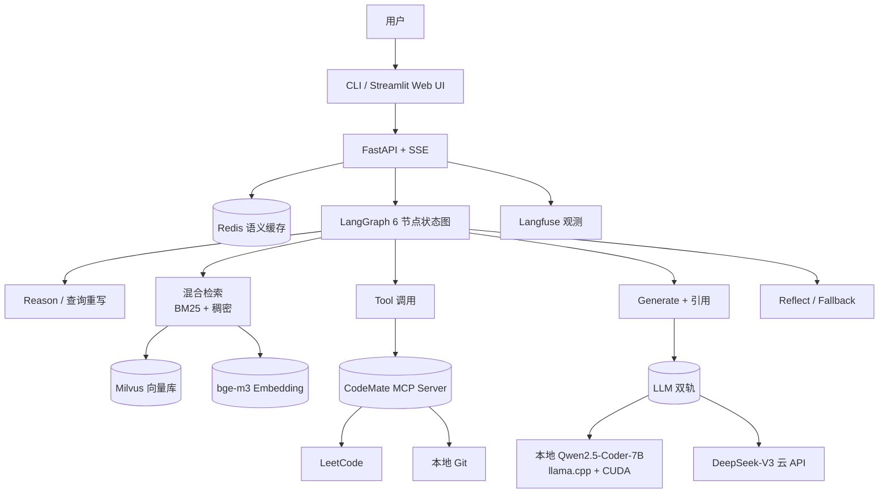

# CodeMate · 程序员代码学习助手

> 为 27 届程序员应届生设计的本地优先 AI 学习搭子：导入个人/公开学习资料 → RAG 问答 + 算法陪练 + 代码 review + 学习计划编排。
>
> **当前阶段**：W4 · Phase 0 调研结束，仓库骨架初始化 ｜ **目标版本**：v1.0（W9 结束 / 2026-07-12）

---

## 一、项目定位

- **场景**：碎片化学习→ 多套笔记 → 复习效率低
- **方案**：4 个核心功能整合到一个 LangGraph Agent 里
- **差异化**：本地优先（RTX 4060 跑 Qwen2.5-Coder-7B）+ C++ 性能拓展点

## 二、核心功能

| # | 功能 | MVP 级别 | 输入 | 输出 |
|---|---|---|---|---|
| A | 知识库问答（RAG） | **MUST**（W4-W6）| "TCP 三次握手为什么不能两次" | 带引用的解释（来源：小林 coding 等）|
| B | 算法陪练 | **MUST**（W5-W6）| "我不熟 DP" | 推 LeetCode 题 → LLM review 你的解 → 记录掌握度 |
| C | 代码 review | SHOULD（W9）| 一段 C++/Python 代码 | 复杂度分析 + bug + 改进建议 |
| D | 学习计划编排 | COULD（W9 有余力）| "两周内掌握 LangGraph" | 14 天日级计划 |

## 三、架构概览



详细架构与设计决策见 [`docs/architecture.md`](docs/architecture.md)。

## 四、快速开始（Quick Start）

> **现阶段（Phase 0 末）**：仓库骨架已就绪，代码尚未实现。W4 启动后下列命令逐步可用。

```bash
# 1. 装 uv（Python 包管理器，比 pip 快 10-100 倍）
curl -LsSf https://astral.sh/uv/install.sh | sh

# 2. clone 与初始化
git clone https://github.com/songCY0809/codemate.git
cd codemate
uv sync                                 # 装依赖

# 3. 配置环境变量
cp .env.example .env
# 编辑 .env：填 DEEPSEEK_API_KEY 等

# 4. 起依赖服务（Milvus 等，W5 起需要）
docker compose up -d milvus

# 5. 导入笔记
uv run codemate ingest data/notes/

# 6. 提问
uv run codemate ask "TCP 三次握手为什么不能两次"

# 7. 算法陪练
uv run codemate practice --weak dp
```

## 五、技术栈

| 类别 | 工具 | 选型理由 |
|---|---|---|
| 编排 | LangGraph | 状态图 + HITL + checkpoint |
| LLM | DeepSeek-V3 + 本地 Qwen2.5-Coder-7B | 双轨切换，云便宜本地省成本 |
| 推理 | llama.cpp + CUDA 卸载 | RTX 4060 跑 7B-Q4 飞快 |
| Embedding | bge-m3（智源） | 中文场景主流，本地 0 成本 |
| 向量库 | Milvus（主）+ Chroma（W4 入门）| Milvus 性能 + 中文文档 |
| 检索 | BM25 + 稠密混合 + Cross-Encoder Reranker | 真正的 hybrid（不是 Khoj/AnythingLLM 的"伪混合"）|
| 服务 | FastAPI + SSE | 流式输出标配 |
| 缓存 | Redis 语义缓存 | 成本下降 30%+ |
| 部署 | Docker Compose | 一键起 |
| 观测 | Langfuse（自部署）| 链路追踪 + badcase 回流 |
| 评估 | Ragas | Faithfulness / Answer Relevance / Context Precision |
| 工具 | MCP（Model Context Protocol）| 暴露给 Cursor / Claude Desktop |
| CLI/UI | typer + Streamlit | CLI 优先，W9 加 Web UI |

## 六、路线图（与学习路线 v1.1 同步）

> 详见 [`AI-Agent-学习路线.md`](../ai-agent-roadmap/AI-Agent-学习路线.md) §3-7

| 里程碑 | 截止日期 | 版本 | 包含内容 |
|---|---|---|---|
| M0 调研 + 骨架 | **2026-05-11**（**当前**）| v0.0 | Phase 0 调研、目录结构、Roadmap |
| M1 RAG MVP | 2026-06-07 (W4 末) | v0.1.0-alpha | 知识库导入 + Chroma 检索 + CLI 提问 |
| M2 Agentic RAG + MCP | 2026-06-14 (W5 末) | v0.2.0-alpha | Milvus + 混合检索 + MCP server |
| M3 CodeMate Core | 2026-06-21 (W6 末) | **v0.1.0** | 功能 A + B + LangGraph + FastAPI |
| M4 工程化 | 2026-07-05 (W8 末) | **v0.5.0** | Docker Compose + Langfuse + Ragas |
| M5 简历版 | 2026-07-12 (W9 末) | **v1.0.0** | C++ 拓展 + Streamlit + 简历交付 |
| M6 延伸 | 2026-07 中下旬 | v1.1.0 | 桌宠化 / A 方向延伸 |

## 七、致谢

CodeMate 站在巨人肩膀上，明确致敬以下开源项目：

- [khoj-ai/khoj](https://github.com/khoj-ai/khoj) —— RAG pipeline、对话截断、强制引用 prompt 模式
- [Mintplex-Labs/anything-llm](https://github.com/Mintplex-Labs/anything-llm) —— Loader Registry 设计、统一 Document Schema、Vector Store 抽象
- [SPerekrestova/interactive-leetcode-mcp](https://github.com/SPerekrestova/interactive-leetcode-mcp) —— LeetCode GraphQL 查询与 Submit/Cookie 流程的权威参考实现

详细借鉴对应表见 [`docs/phase0-investigation.md`](docs/phase0-investigation.md) §7.3。

## 八、目录结构

```
codemate/
├── README.md                  # 本文件
├── pyproject.toml             # 依赖与项目元数据（uv 管理）
├── .env.example               # 环境变量模板
├── .gitignore
├── docker-compose.yml         # Milvus + Redis + Langfuse（W5 起）
├── docs/
│   ├── architecture.md        # 架构图与设计决策
│   ├── phase0-investigation.md # ★ 三大参考项目调研报告
│   └── roadmap.md             # 详细路线图（与学习路线同步）
├── src/codemate/
│   ├── __init__.py
│   ├── settings.py            # pydantic-settings 读 .env
│   ├── llm/                   # LLM 客户端（DeepSeek / 本地）
│   ├── loaders/               # 文档加载器（markdown/docx/yuque）
│   ├── chunkers/              # 分块策略
│   ├── embeddings/            # bge-m3 客户端
│   ├── retrieval/             # vector store + BM25 + hybrid + reranker
│   ├── graph/                 # LangGraph 状态图
│   ├── tools/                 # ReAct 工具实现
│   ├── mcp_server/            # CodeMate 自己的 MCP server
│   ├── features/              # 高层功能编排（A/B/C/D）
│   ├── persistence/           # SQLite 持久化
│   ├── api/                   # FastAPI app
│   ├── cli/                   # 命令行入口
│   └── ui/                    # Streamlit Web UI（W9）
├── data/                      # 笔记/向量数据（gitignored）
├── examples/                  # 示例问题与样本数据
├── tests/                     # 测试
└── scripts/                   # 实用脚本（ingest、压测等）
```

## 九、License

[Apache 2.0](LICENSE)（计划在 W4 加 LICENSE 文件）
