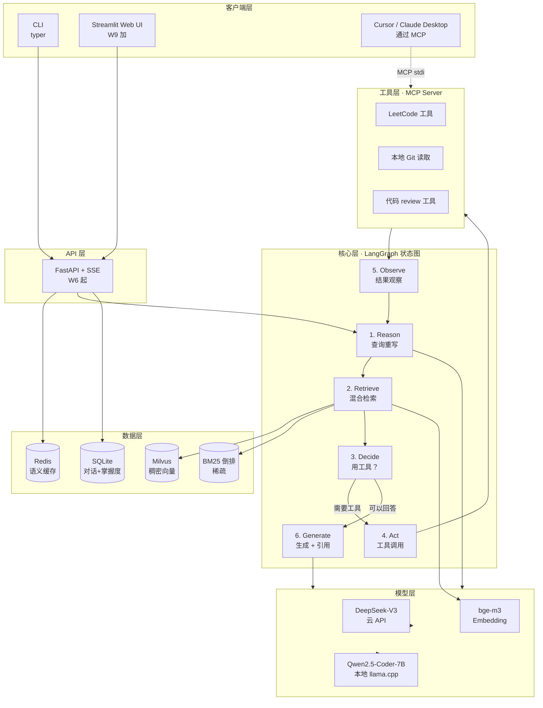

# CodeMate 架构文档

> **版本**：v0.0（W4 启动前的设计稿）  
> **更新**：2026-05-11  
> **配套**：[Phase 0 调研报告](phase0-investigation.md) ｜ [路线图](../../ai-agent-roadmap/AI-Agent-学习路线.md)

---

## 1. 整体架构



## 2. 模块职责

| 包 | 职责 | 主要交互方 | 起始周 |
|---|---|---|---|
| `settings` | 配置加载（pydantic-settings 读 .env）| 所有模块 | W1 |
| `llm` | LLM 客户端抽象，本地/云双轨 | `graph`, `features`, `mcp_server` | W1 |
| `loaders` | 文档加载（markdown/docx/yuque），输出 `DocumentRecord` | `features.rag_qa` 的 ingest 路径 | W4 |
| `chunkers` | 分块策略，输出 `Chunk` | `loaders` 下游 | W4 |
| `embeddings` | bge-m3 客户端，输入文本 → 向量 | `retrieval`, ingest pipeline | W4 |
| `retrieval` | 向量存储 + BM25 + 混合 + Reranker | `graph.nodes.retrieve` | W4-W5 |
| `graph` | LangGraph 状态图（6 节点）| `features` 的核心 | W3-W6 |
| `tools` | ReAct 工具实现 | `graph.nodes.act`, `mcp_server` | W5 |
| `mcp_server` | CodeMate 暴露给 Cursor 的 MCP server | 外部 MCP client（Cursor 等）| W5 |
| `features` | 高层功能编排（A/B/C/D），调 graph + 持久化 | `api`, `cli` | W6 |
| `persistence` | SQLite 对话历史 + 算法掌握度 | `features` | W6 |
| `api` | FastAPI app + SSE 路由 | 外部 HTTP 客户端 | W6 |
| `cli` | typer CLI 入口 | 用户 / 开发者 | W6（W1 也用） |
| `ui` | Streamlit Web UI | 用户 | W9 |

## 3. 关键设计决策

### 3.1 双轨 LLM 切换（学 Khoj 接口形态）

```python
class LLMClient(Protocol):
    async def chat(self, messages: list[Message], **kw) -> AsyncIterator[str]: ...
    async def chat_with_tools(self, messages, tools: list[ToolSchema], **kw) -> ToolCallResult: ...

class DeepSeekClient(LLMClient): ...
class LocalLlamaClient(LLMClient): ...     # llama.cpp OpenAI-compat endpoint

# 工厂在 settings 里读 LLM_DEFAULT_BACKEND
def make_llm() -> LLMClient: ...
```

**好处**：W2 实现完本地推理后，所有上层代码不用改。

### 3.2 Loader Registry（学 AnythingLLM）

```python
LOADER_REGISTRY: dict[str, type[Loader]] = {
    ".md": MarkdownLoader,
    ".markdown": MarkdownLoader,
    ".docx": DocxLoader,
    ".txt": TextLoader,
}

# 调度
def load_path(path: Path) -> Iterator[DocumentRecord]:
    ext = path.suffix.lower()
    loader_cls = LOADER_REGISTRY.get(ext, TextLoader)   # 回退当 txt（学 AnythingLLM）
    yield from loader_cls().load(path)
```

**统一 schema**：所有 loader 输出 `DocumentRecord(doc_id, title, chunk_source, page_content, metadata)`，下游 chunker/embedder 不关心来源。

**Frontmatter 解析**：`MarkdownLoader` 用 `python-frontmatter` 解析 YAML，把字段注入 `metadata`：

```python
import frontmatter

def load(self, path: Path) -> Iterator[DocumentRecord]:
    post = frontmatter.load(path)
    yield DocumentRecord(
        doc_id=str(path.relative_to(self.root)),
        title=post.get("title") or path.stem,
        chunk_source=f"markdown://{path}",
        page_content=post.content,
        metadata={
            "week": post.get("week"),          # W1-W9，可做时间过滤
            "type": post.get("type"),          # concept | crash | weekly
            "tags": post.get("tags", []),
            "status": post.get("status"),      # draft | reviewed | mastered
            "source_links": post.get("source", []),
        },
    )
```

**第一类 RAG 数据源 · 学习笔记目录**：

```bash
codemate ingest \
  --source ../ai-agent-roadmap/notes/concepts \
  --source ../ai-agent-roadmap/notes/crashes \
  --source ../ai-agent-roadmap/notes/weekly
```

约定：所有以 `_` 开头的目录（如 `_templates/`）自动跳过，避免污染向量库。
笔记规范见 [`../../ai-agent-roadmap/notes/README.md`](../../ai-agent-roadmap/notes/README.md)。

### 3.3 Chunking 三层策略（学 Khoj + AnythingLLM）

```
input markdown
  ↓
[Layer 1] 按标题层级切分（语义边界）
  ↓
[Layer 2] RecursiveCharacterTextSplitter（兜底大块拆小）
  ↓
[Layer 3] buildHeaderMeta：每个 chunk 前注入 <document_metadata>title|section|source</document_metadata>
  ↓
output Chunk[]
```

**注意**：与 AnythingLLM 不同，CodeMate 的 metadata header 对 `file://` / `yuque://` / `markdown://` 全都注入（AnythingLLM 只认 link/youtube）。

### 3.4 真正的混合检索（CodeMate 原创亮点）

```python
class HybridRetriever:
    async def retrieve(self, query: str, top_k: int = 10) -> list[Chunk]:
        # 1. 并发跑稀疏 + 稠密
        bm25_hits, dense_hits = await asyncio.gather(
            self.bm25.search(query, k=50),
            self.dense.search(query, k=50),
        )
        # 2. RRF（Reciprocal Rank Fusion）融合
        fused = reciprocal_rank_fusion([bm25_hits, dense_hits], k=60)
        # 3. Cross-Encoder Reranker 精排
        reranked = await self.reranker.rerank(query, fused[:30])
        return reranked[:top_k]
```

**为什么这是原创亮点**：Khoj 没做真混合（向量+filter），AnythingLLM 也没做（向量+rerank）。CodeMate 是**少数真正实现 BM25+稠密融合**的开源 RAG。

### 3.5 LangGraph 6 节点状态图（学 LangGraph Tutorial）

```python
class AgentState(TypedDict):
    user_query: str
    rewritten_query: str
    chunks: list[Chunk]
    tool_calls: list[ToolCall]
    tool_results: list[ToolResult]
    iter: int
    final_answer: str
    citations: list[Citation]

graph = StateGraph(AgentState)
graph.add_node("reason", reason_node)        # 查询重写 + 决定是否需要工具
graph.add_node("retrieve", retrieve_node)    # 混合检索
graph.add_node("decide", decide_node)        # 决策：直接答 / 调工具 / 再检索
graph.add_node("act", act_node)              # 调用工具
graph.add_node("observe", observe_node)      # 处理工具结果
graph.add_node("generate", generate_node)    # 生成最终答案 + 引用

graph.add_edge(START, "reason")
graph.add_conditional_edges("reason", reason_router)        # → retrieve / generate
graph.add_edge("retrieve", "decide")
graph.add_conditional_edges("decide", decide_router)        # → act / generate / END
graph.add_edge("act", "observe")
graph.add_conditional_edges("observe", observe_router)      # → reason（再循环）/ generate
graph.add_edge("generate", END)
```

**最大轮次**：默认 8 轮，避免死循环（学路线图 §2.4）。

### 3.6 强制引用 prompt（学 Khoj）

```python
GENERATE_SYSTEM_PROMPT = """\
你是 CodeMate，应届生的代码学习搭子。回答必须遵守：

1. **必须引用来源**：每条事实陈述后面用 [1] [2] 标注；
2. **引用编号对应**：编号对应 CONTEXT 里的 chunk 顺序；
3. **不确定就说不知道**：宁可少答，不要捏造；
4. **代码示例用 ```语言 ... ``` 包裹**。

CONTEXT:
{chunks_with_index}

回答用中文。
"""
```

**citation 后处理**：从最终回答里正则抽出 `[N]`，把对应 chunk 的 `chunk_source` + `metadata.section` 输出给前端展示。

### 3.7 对话截断（学 Khoj `truncate_messages`）

```python
def truncate_messages(messages: list[Message], model_budget: int) -> list[Message]:
    """发送前从最旧开始丢，直到 token 估算 ≤ budget；
    必要时截断当前条（保留首尾各 N 字）。"""
```

### 3.8 MCP Server（学 leetcode-mcp）

```python
# src/codemate/mcp_server/server.py
from mcp.server import Server
from mcp.server.stdio import stdio_server

server = Server("codemate")

@server.list_tools()
async def list_tools() -> list[Tool]: ...

@server.call_tool()
async def call_tool(name: str, args: dict) -> list[TextContent]:
    if name == "get_problem":
        ...
```

**LeetCode 通信**：把 leetcode-mcp 的 GraphQL 查询字符串 + submit/cookie 逻辑**逐行移植到 Python**（不用 leetcode-query npm 包）。

## 4. 数据模型（SQLite）

```sql
-- 对话历史（学 Khoj conversation_log 但更轻）
CREATE TABLE conversations (
  conv_id TEXT PRIMARY KEY,
  user_id TEXT,                  -- 单用户场景固定 "default"
  title TEXT,
  created_at TIMESTAMP,
  updated_at TIMESTAMP
);

CREATE TABLE messages (
  msg_id INTEGER PRIMARY KEY AUTOINCREMENT,
  conv_id TEXT REFERENCES conversations(conv_id),
  role TEXT CHECK(role IN ('system','user','assistant','tool')),
  content TEXT,
  metadata JSON,                 -- 引用、tool_calls、token 用量等
  created_at TIMESTAMP
);

-- 算法掌握度（功能 B 核心）
CREATE TABLE problems (
  problem_id TEXT PRIMARY KEY,   -- LC slug
  title TEXT,
  difficulty TEXT,
  tags JSON                      -- ["dp", "greedy", ...]
);

CREATE TABLE attempts (
  attempt_id INTEGER PRIMARY KEY AUTOINCREMENT,
  problem_id TEXT REFERENCES problems(problem_id),
  code TEXT,
  language TEXT,
  verdict TEXT,                  -- AC / WA / TLE / RE
  llm_review TEXT,               -- LLM 给的 review
  created_at TIMESTAMP
);

CREATE TABLE mastery (
  tag TEXT PRIMARY KEY,          -- "dp" 等
  score REAL DEFAULT 0.5,        -- 0.0-1.0
  last_review_at TIMESTAMP,      -- 艾宾浩斯曲线下次复习时间
  attempt_count INTEGER DEFAULT 0
);
```

**艾宾浩斯曲线**：根据 `last_review_at` + `score` 计算"今天该复习哪些"。简单实现：score 越低，间隔越短。

## 5. 性能与成本目标（W7-W8 评估时核对）

| 指标 | 目标 | 测量方法 |
|---|---|---|
| 召回率 @5（功能 A）| ≥ 85% | Ragas Context Precision，30 题评估集 |
| 召回率 @5（vs Khoj 单稠密 78%）| **目标 92%**（混合检索加分）| 同 |
| 首字延迟 P95（DeepSeek） | ≤ 2s | Langfuse trace |
| 首字延迟 P95（本地 Qwen） | ≤ 3s | 同 |
| 完整回答平均耗时 | ≤ 8s | 同 |
| 月 token 成本（W7-W8 评估期） | ≤ ¥80 | DeepSeek 后台 |
| Redis 语义缓存命中率 | ≥ 30% | 自埋点 |
| Ragas Faithfulness | ≥ 0.85 | Ragas 评估 |

## 6. 安全与稳定性（W7 工程化重点）

- **API Key 不入仓**：`.env` 通过 `.gitignore`；`.env.example` 入仓做模板
- **MCP 工具白名单**：`shell` 工具命令白名单；`read_local_repo` 路径白名单
- **Prompt Injection 防护**：用户输入消毒（过滤"忽略之前的指令"等）+ 工具调用 schema 强校验
- **PII 脱敏**：日志里 LeetCode `LEETCODE_SESSION` cookie 掩码
- **Fallback 降级**：DeepSeek 429 → 切本地 Qwen；本地不可用 → 返回兜底答案 + 错误码
- **最大轮次限制**：LangGraph 状态图最多 8 轮，避免死循环
- **对话超长**：发送 LLM 前 `truncate_messages` 控制在 model_budget 内

## 7. 待定 / 后续讨论

- [ ] 是否需要 MultiQuery 重写（W5 评估实际收益再定）
- [ ] Reranker 用 bge-reranker-v2-m3 还是 cross-encoder-ms-marco（W5 对比）
- [ ] 语雀 API 是否走 OAuth（暂用 token 模式）
- [ ] 桌宠化（v1.1+）：fork Open-LLM-VTuber 还是 reor
